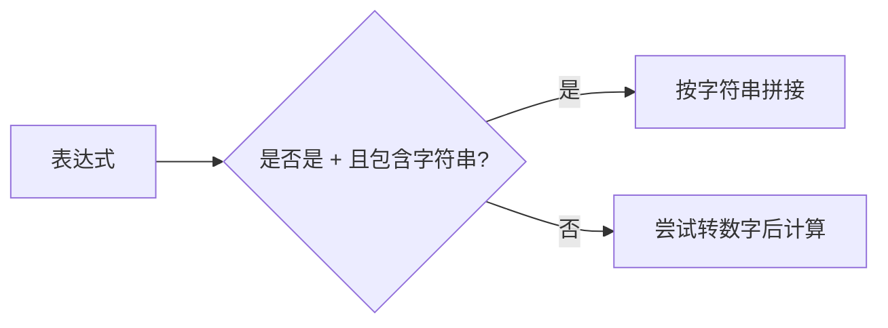
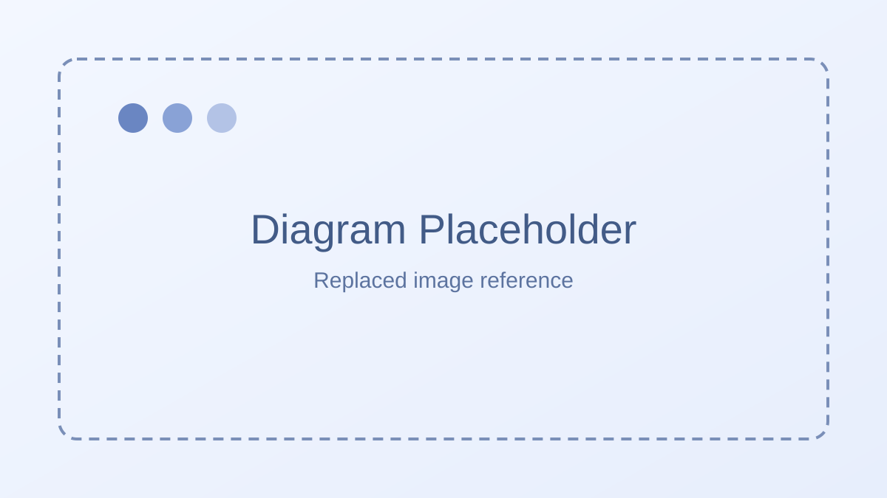
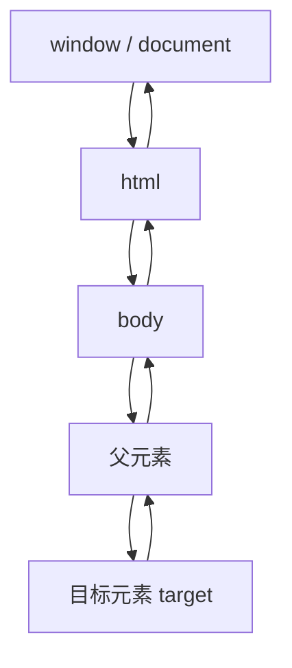
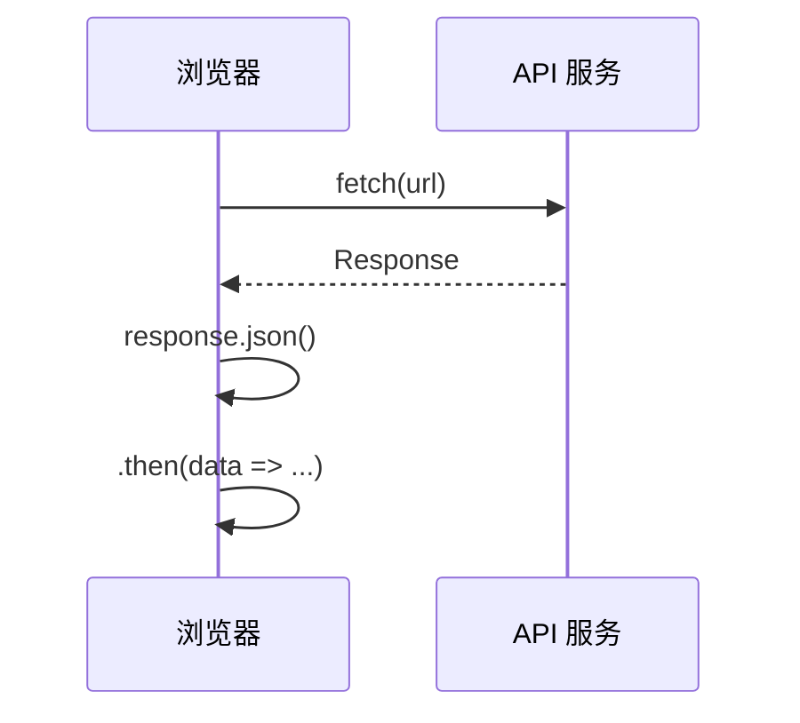

# JavaScript

## 认识JavaScript：

这个语言是专门于网页交互的脚本语言。对于初学者，我们应该关注的是效果，即什么东西可以实现什么效果。

JavaScript 主要由三部分组成：

1. 核心（ECMAScript）
2. 文档对象模型（DOM）
3. 浏览器对象模型（BOM）

我们可以将这三部分作为三个部门，每个部门都由自己的职责，首先我们来搞 核心（ECMAScript）

### 核心 (ECMAScript)

ECMAScript 规定了**这门语言的组成部分**， 主要由以下几个部分组成：

* 语法
* 类型
* 语句
* 关键词
* 保留字
* 操作符
* 对象

有了这些。JavaScript 就可以完成基本的**逻辑以及数据处理**

### 文档对象模型（DOM）

DOM 的功能简单来说就是可以获得我们写的所有 html 标签，并给标签添加或者删除样式，并可以给标签添加事件（点击事件，拖动等）。这些功能的实现是基于下面的几种接口：

* DOM 遍历和范围：可以找到页面中所有的标签；
* DOM 事件： 例如给某个图片添加拖动事件，使图片可以任意拖动；
* DOM 样式： 可以更改页面中所有的元素样式，例如更改某一段文字的颜色。

### 浏览器对象模型（BOM）

BOM 只会处理跟浏览器相关的东西，比如：

* 弹出新窗口
* 移动，缩放，关闭浏览器串口的功能
* 给用户提供显示器分辨率的功能
* 提供浏览器信息

## 在 HTML 中使用 JavaScript：

### JavaScript 的书写位置：

JavaScript 与 css 的书写位置非常相似，分为 HTML 内部和外部

JavaScriptt 写在 HTML 内部

1. 使用 script 标签嵌入 JavaScript

// <script></script>// 标签可以将 JavaScript 代码镶嵌到 HTML 内部，具体嵌入方式：

```html
<script>
    let name = "Bob";
    function() {
        console.log("我的名字叫" + name);
    }
</script>
```

> // <script type="text/javascript charset="utf-8"></script>// 这种类型的 script 标签，其实它跟// <script></script>//标签是一样的，其中  type="text/javascript" 代表文档类型是 javascript 类型，字符编码是 utf-8

### 注意 script 标签 HTML 文档的位置

这里我们强行规定一个位置或者是这是一种规范，即 body 标签内部，并保证是在末尾，如下面的代码所示：

```html
<!DOCTYPE html>
<html lang="en">
    <head>
        <meta charset="utf-8" />
        <title>Document</title>
    </head>
    <body>
        <!--正常的html标签一定写在script标签里面-->
        <div></div>
        <!--在 body 标签的内部并在末尾-->
        <script></script>
    </body>
</html>
```

> script 标签在 HTML 文件中的位置和随意，但是在 JavaScript 的 DOM 的时候，如果不注意 script 标签的位置，会出现意想不到的错误

### javascript 写在 HTML 代码外：

和 CSS 一样，在 javascript 中 我们也是将代码分离，即 JavaScript 代码写在 xxx.js 文件里面，然后由标签去引入。

这里的标签引入即 script 标签，不一样的是在标签里面多了个 src 参数

```html
<script src='index.js'></script>
```

书写位置与内部的书写位置一样，即书写在 body 标签内部。但是在末尾。

## 变量：

变量是保存值的占位符号，在 JavaScript 中定义变量的关键字有两个 **let，const**。

### 使用 let 定义变量：

定义格式：

```JavaScript
let name = "Will Smith";
```

* 关键字：编程语言中特定的单词
* 变量名：用于保存值的占位符
* 赋值符号：将值赋给变量符号

```javascript
let name = "Will Smith";
console.log(name);
```

 **运行 js 文件终端命令：**

```JavaScript
node ./index.js //文件名
```

与运行 c 语言类似。但是 c 语言需要在终端船舰 .exe 文件

定义变量时注意运行 let 无法重复定义同名变量

### 使用 const 定义变量：

```JavaScript
const name = "Will Smith";
```

### let 与 const 定义变量区别：

* let 定义的变量可以被多次赋值

```JavaScript
let name = "Will Smith";
console.log(name);

name = "Tom";
console.log(name);
```

* const 定义的变量只能赋值一次

```JavaScript
const name = "Bob";
console.log(name);

name = "Tom"; //报错
console.log(name); //不执行
```

* let 定义变量时，可以不用赋初值

```javascript
let age;
console.log(age) //undifind
```

* const 定义变量的时候，要赋值

```JavaScript
const age; //报错
console.log(age) //不执行
```

## 数值类型：

通常的数值类型有**整数，浮点数，NaN (Not a Number) **当然还有其他类型

### 整数：

在 JavaScript 中的整数和数学中的整数是一样的，是正整数，零，负整数，一般里面都是十进制。

### 浮点数：

具体略：：：

> 浮点数的最高数位是17位小数，但是在 JavaScript 中，会出现浮点数运算精度丢失，原因是在其运算时，会先把数值转化为二进制然后对接运算

因此后续不能使用类似程序：

```javascript
if (a + b = 0.3){
    console.log(XXXXXXX);
}
```

### NaN:

即非数值

简单说，就是两个变量执行了运算后返回的结果仍然是数字类型，但是执行的数学运算没有成功：

```JavaScript
let a = 'number';
let b = 2;
let c = a / b;
console.log(c); //NaN
console.log(typeof c); //number
```

> 上述代码中， typeof 是用来判断数值类型的函数

对于上面的情况，我们可以有以下结论：

* 0 / 0
* 字符串与数字 运算
* NaN 与任何数进行运算

返回的结果是 NaN

## 数据类型转换/字符串拼接：

### 隐式类型转换：

#### `+` 遇到字符串：数字会转成字符串并拼接

```JavaScript
console.log(20 + "20");  //结果2020
```

结果不是 `40`，而是 `2020`。因为 `+` 在有字符串参与时会执行拼接。

#### 非加法运算（`-`、`*`、`/`）：字符串会尝试转成数字

```JavaScript
console.log("20" - 10); //10
console.log(10 * "10"); //100
```

进行非加法运算时，字符串会被转换成数字再计算。

#### 两个数字字符串做非加法运算：同样先转数字

```JavaScript
console.log("20" - "10"); //10
```




### 强制类型转化：

强制类型转换常用 `parseInt` 和 `parseFloat`：

- `parseInt`：将字符串解析为整数（会截断小数部分）
- `parseFloat`：将字符串解析为浮点数

#### parseInt：

```JavaScript
let number = "20";
let convertNumber = parseInt(number, 10);
console.log(convertNumber);  //20
console.log(typeof convertNumber); //number
```

#### parseFloat:

```javascript
let number = "10.9";
let convertNumber = parseFloat(number);
console.log(convertNumber); //10.9
console.log(typeof convertNumber); //number
```

### 字符串拼接：

目的就是控制格式

如果我们希望输出结果为这样：

```
转换后的结果是： 20.9
转换后的数字类型是： number 类型
```

有字符串衔接技术：

* 字符串拼接使用的符号为 +
* 字符串用引号引起来，单双引号不做要求
* 变量名不能用引号

```JavaScript
let number = "20.9";
let convertNumber = parseFloat(number);
console.log("转换后的数字类型是：" + typeof convertNumber);
```

**字符串拼接不仅在 console 中使用，也可以在变量里面使用**：

```JavaScript
let age = 20;
let name = "Tom";
let output = "your name is " + name + ", this year " + age + " 岁了";
console.log(output);
```

### 运算符：

#### 全等与相等：

当判断两个值是否相等时，就要用到相等（==）和全等（===）运算符，这两个符号的**区别：前者只判断值是否相等，后者在此基础上还要判断类型是否相等**

```JavaScript
let a = 45;
let b = 45;
let c = '45';
console.log(a == b); // true
console.log(a == c); // false
```

但是后者：

```JavaScript
let a = '45';
let b = 45;
let c = 45;
console.log(a === b); //false
console.log(b === c); //true
```

### 自增自减：

略。。。

### 布尔类型：

略，简单看介个例子：

```JavaScript
let n = 45;
let b = 45;
let isEqual = n === b;
console.log(isEqual);
```


## 条件判断：

略。。。。

### if - else  if- if：

```JavaScript
let a = 17;

if (a < 16){
    console.log(1);
} else if(a >= 16 && a <= 20){
    console.log(2);
} if(a > 20){
    console.log(3);
}
```

### 对于 switch ：

### 简单一下：

```JavaScript
let we = 'rain';
switch (we) {
    case 'snow':
        console.log("coll!");
        break;
    case 'windy':
        console.log("NB");
        break;
    case 'rain':
        console.log("6百66")；
        break;
}
```



## 数组：

### 数组表示：

在 JavaScript 里面，数组的表示方法是一个 [] ：里面的元素用 " , " 隔开： [1, 2, 3, 4]

在 JavaScript （弱语言）里面 ，数组可以包含任意类型。:[1, "第一名" , true] 还可以 数组里面存放数组 [1, "第一名", true , [2, "第二名", false]], 完整的数组初始化：

```JavaScript
let arr = [1, '第一名', true, [2, '第二名', false]];
```

或者：

```JavaScript
let arr = new Array();
let arr2 = new Array(1, 2, 'arr')
```

### 数组索引：

例如; 

```javascript
['1', '2', '3', '4']
  0   1    2    3
```

后略。。。

## 数组元素操作（增、删、改、查）：

### 数组元素操作--增：

#### push 方法（从尾加）：

push 方法可以在数组的末尾添加值，使用方法：

```JavaScript
变量名.push('XXX');
```

例如：

```JavaScript
let schools = ['aaa', 'bbbb', 'sss', 'ddd'];
schools.push('eee');
console.log(schools);
```

#### unshift 方法（从头加）：

略。。

### 数组元素操作--删：

#### pop 方法（从后删）：

```JavaScript
let s = ['qqq', 'www', 'eee']
//从后删除一个元素
s.pop();
console.log(s);
```

#### shift 方法（从前删）：

略。。。。

#### splice 方法（删除指定位置）：

##### 一个参数：

splice 方法在括号里面存在参数：

例如：

```JavaScript
let a = ['qqq', 'www', 'eee', 'rrr', 'ttt'];
//删除从下标为1往后的元素，包括1
let delete_a = a.splice(1); //该方法返回为 ！！！被删除的元素！！！
console.log(delete_a);  //['www', 'eee', 'rrr', 'ttt']
console.log(a); //['qqq']
```

##### 两个参数：

```JavaScript
let a = ['qqq', 'www', 'eee', 'rrr', 'ttt'];
//删除从0开始往后两个元素：
let delete_a = a.splice(0, 2);
console.log(delete_a);  //['qqq', 'www']
console.log(a); //['eee', 'rrr', 'ttt']
```

> 这些索引规则个你 py 里面一样，包含开头，不包含结尾

### 数组元素操作--改：

#### splice 方法（需指定位置修改元素）：

splice 方法可以添加三个参数:

* 第一个值，整数类型，表示起始位置
* 第二个值，整数类型，表示步长（例如：1代表往后1个元素）
* 第三个值，要替换的数组值

eg：

```JavaScript
let s = ['清华', '北京', '浙江', '同济'];

s.splice(2, 0, '江西');
console.log(s);  //["清华大学", "北京大学", "江西理工大学", "浙江大学", "同济大学"]
```

在这个案例里面， splice 方法的第一个参数是 2 ，第二个参数是 0 ，也就是说从下标 2 开始，往后走 0 个步长，然后用 '江西' 替代这个 0 个步长里的内容。

经过一系列操作以后，给别人的感觉貌似在1，1与2，1之间添加的，实则不然，splice的意义还是替换，只不过这里的步长是0

eg：

```JavaScript
let s =['清华', '北京', '浙江', '同济'];

s.splice(2, 1, '江西');
console.log(s);   //["清华大学", "北京大学", "江西理工大学", "同济大学"]
```

当步长为1，从2开始，往后走 1 ，就选中了'浙江', 然后用'江西'替换'浙江'

eg:

```javascript
let s = ['清华', '北京', '浙江', '同济'];

s.splice(2, 2, '江西');
console.log(s);  // ["清华大学", "北京大学", "江西理工大学"]
```

这个案例里面步长为 2， 开始位置为 2，这样就选折’浙江‘与'同济'

再将这两个值用'江西'代替

### 数组元素操作--查：

查询数组中是否含有某个元素，我们在这一节只学习一个方法--**indexOf()**

**indexOf ()**括号内可以添加 2 个参数，不过我们常用的是添加一个参数的情况，

#### 一个参数：

比如说：我们要查找 s 里面是否有某个值：

```JavaScript
let s = ['清华', '北京', '这将', '同济']；

let result = s.indexOf('大连');
console.log(result); // -1
```

**返回值为 -1 表示未找到，非 -1 数字表示找到的元素下表**

#### 连个参数：

第一个参数是我们要找的值，第二个参数是开始寻找的位置，

eg

```javascript
let s = ['清华大学', '北京大学', '浙江大学', '同济大学'];

let result = s.indexOf(浙江大学)；
console.log(result); //2
```

如果：

```JavaScript
let schools = ['清华大学', '北京大学', '浙江大学', '同济大学'];

let result = schools.indexOf('浙江大学', 3);
console.log(result); // -1
```

这时候光标会在 3 的位置开始往下历遍。


### 二维数组：

我们知道一维数组的括号是 [ ] 那么二维数组就是在一维数组内继续添加 [ ] ：

```
[1, '第一名', true, [2, '第二名', false]];
```

可以看见在一维数组里面还可以添加数组，如果将以为数组里面的非数组元素删除，这个数组就是二维的

```
[[2, '第二名', false]];
```

eg:

```javascript
[
  [2, '第二名', false],
  [2, '第二名', false],
  [2, '第二名', false],
];
```

#### 取值：

```JavaScript
let arr2 = arr[0];
console,log(arr2);  //[2,'第二名',false]
```

取出 arr2 内部的元素：

```JavaScript
let number = arr2[0];
console.log(number); //2
```

合成上面两步：

```JavaScript
let number = arr[0][0];
console.log(number);  //2
```

#### 添加值：

比如完成这个表：


```JavaScript
let arr1 = [];  //定义一个一维空数组
// 添加值
arr1[0] = '宇智波佐助';
arr1[1] = '男';
arr1[2] = '下忍';
arr1[3] = 12;

console.log(arr1); // ['宇智波佐助','男','下忍',12]

let arr2 = [];
arr2 = [];
arr2[0] = '春野樱';
arr2[1] = '女';
arr2[2] = '下忍';
arr2[3] = 12;

arr3 = [];
arr3[0] = '漩涡鸣人';
arr3[1] = '男';
arr3[2] = '下忍';
arr3[3] = 12;
console.log(arr3); // ['漩涡鸣人','男','下忍',12]

let arr = [];
arr[0] = arr1;
arr[1] = arr2;
arr[2] = arr3;
console.log(arr);
// [
//   ['宇智波佐助', '男', '下忍', 12],
//   ['春野樱', '女', '下忍', 12],
//   ['漩涡鸣人', '男', '下忍', 12],
// ]
```

还可以用 push 的方法：

```javascript
let arr = [];
arr.push([]);
arr[0].push('宇智波佐助');
arr[0].push('男');
arr[0].push('下忍');
arr[0].push(12);

arr.push([]);
arr[1].push('春野樱');
arr[1].push('女');
arr[1].push('下忍');
arr[1].push(12);

arr.push([]);
arr[2].push('漩涡鸣人');
arr[2].push('男');
arr[2].push('下忍');
arr[2].push(12);

console.log(arr);
```

> 注意 arr.push([]);  在arr 数组末位添加空数组

## for 循环：

JavaScript 的 for 循环与 java c 的很相似。

### for循环的写法:


### for...in 与 for...of 的写法：

for...in 的语法是这样的：

```JavaScript
let p = ['1'， '2', '3', '4'];

for (let i in p){
    console.log(p[i]);
}
```

for ...in循环会访问数组里面的每一项，这里的 i 对应数组中的每一项的下标。

类似于 python，java， batch Script 的 for 循环

### for...of 循环 ：

```JavaScript
let p = ['1', '2', '3', '4'];

for (let item of p){
    console.log(item);
}
```

**两者区别是：for...in 是历遍数组里面的 下标。 而 for...of 是历遍数组里面的  元素**

### while 循环 与 do...while：

在  js  里面支持 while 循环与 do...while，


> 注意： **初始条件写在 while 外面，更新条件写在  while  里面**

```JavaScript
let peppaFriends = ['小狗丹尼', '小猫坎迪', '狐狸弗雷迪', '小狼温蒂', '大象艾米丽', '小兔瑞贝卡', '小羊苏西'];

let i = 0;
while (i < peppaFriends.length ) {
  console.log(peppaFriends[i]);
  i++;
}
```


```js
let i = 0;

do {
  console.log(i); // 输出：0
  i++;
} while (i < 0 );
```

### 跳出循环：

#### break : 跳出整个循环：

当符合条件时，利用 break 来跳出整个循环：

```JavaScript
let num = [1, 1, 2, 3, 5, 8, 13, 21, 34, 55, 89, 144, 233, 377, 610, 987, 1597, 2584, 4181, 6765, 10946, 17711, 28657, 46368];

for(let i = 0;i < num.length;i++) {
  if (num[i]%5 === 0) {
    console.log(num[i]);
    // 用 break 跳出循环
    break;
  }
}

// 循环之后的语句
console.log("循环之后的语句");
```

#### 跳过迭代  continue：

当符合条件时，利用 continue 来跳过某次迭代：

```JavaScript
let num = [1, 1, 2, 3, 5, 8, 13, 21, 34, 55, 89, 144, 233, 377, 610, 987, 1597, 2584, 4181, 6765, 10946, 17711, 28657, 46368];

for(let i = 0;i < num.length;i++) {
  if (num[i]%5 === 0) {
    // 用 continue 跳出符合条件的这一次迭代
    console.log("跳过了第" + (i + 1) + "个数：" + num[i]);
    continue;
  }
  const handledNum = num[i] / 5;
  console.log(handledNum);
}

// 循环之后的语句
console.log("循环之后的语句");
```

略》》》》》》》

## 函数：

在随机数的生成 JavaScript 与 java 一样：

1. 先获取 [0, 1000] 之间的随机数：

```JavaScript
const num = Math.random() * 1000;
```

2. 再获得 [100, 1000] 之间的随机数的数.
   
   要获得 [100, 1000] 的数， 那么 Math.random() 应该属于 [0.1, 1]。

我们处理一下

```javascript
// num1 的范围是 [0.1, 1)
const num1 = Math.random() * 0.9 + 0.1
// num2 的范围是 [100, 1000)
const num2 = Math.floor(num1 * 1000);

console.log(num2);
```

> Math.floor(x) 是 js 的内置方法，返回小于 x 的最大整数。比如，Math.floor(2.3) 返回的是2， Math.floor(4.9) 返回的是 4。

### 自定义函数：

#### 函数声明：

js 里面函数声明有三种方法，这里我们主要讲两种：function 命令和函数表达式。

##### 用 function 命令声名：

###### 格式：

```JavaScript
function print(){
    console.log("xxx")
}
```


1. 关键词“function”
2. 函数名“print” 
3. 函数名跟个小括号
4. 包裹函数体使用大括号，里面可以没有代码

> 函数名往往和函数的功能有关系，一般我们使用驼峰命名法

##### 用函数名表达式进行命名：

```JavaScript
let print = function() {
    console.log("XXX");
};
```


或者：

```JavaScript
let print = () => {
    console.log("XXXX");
};
```

#### 函数声名提升：

采用 function 进行命名时，整个函数会被提到代码顶部，跟 c 语言相似

#### 函数的重复声名：

如果同一个函数被定义多次，后面的函数会覆盖前面的函数

#### 立即执行函数（IIFE）：

```JavaScript
(function() {
    console.log("XXX");
})();
```

它会在函数声名后立即调用，后期无法调用。

## 函数参数：

这里面形式参数可以直接在函数体里面使用，其他略

还有就是，参数可以设置默认值，防止用户输入时遗漏参数：

```JavaScript
function code(figure, txt="随机数") {
    const num1 = Math.random() * 0.9 + 0.1;
    const num2 = Math.floor(num1 * Math.pow(10, figure));

    console.log(txt, num2);
}

code(6);  //结果为 : 随机数, 333333
```

## 函数返回值：

js 与其他编译软件一样，分为有返回值与无返回值，

函数需不需要返回值是看实际需求的

比如我们现在需要创建一个随机数作为验证码：

```JavaScript
let userCode = 3333333;
//参数 figure 位数
let code = (figure)=> {
    const num1 = Math.random() * 0.9 + 0.1;
    const num2 = Math.floor(num1 * Math.pow(10, figure));

    return num2;
}

let result = code(6);

consloe.log(result)
```

函数是否需要返回值是看实际需求的，

```JavaScript
let userCode = 33333;

function code(figure) {
    const num1 = Math.random() * 0.9 + 0.1;
    const num2 = Math.floor(num1 * Math.pow(10, figure));

    return num2;
}

let result = code(6);

if (result === userCode) {
    console.log("验证码正确");
} else {
    console.log("验证码错误");
}
```

**函数里 return 后的语句不会再执行**

## 内置函数——计时器：

我们通常进行注册，登录的时候遇见验证手机号的情况，点击获得验证码后，为了防止用户频繁获取，我们会在点击获取后倒计时60s。

倒计时每一秒会更新一下买这个就可以用js里面的定时执行函数：**setTimeout（）**和**setInterval（）**来完成叫做定时器。

### 延时执行： setTimmeout（）：

setTimeout 函数用来指定某个函数或者某段代码，在多少ms后执行。它返回一个整数，表示定时器的编号，以后可以用来取消这个定时器。

setTimeout 函数的语法：


```JavaScript
let timeId = setTimeout(func | code, delay);
```

setTimeout 含有两个参数，第一个参数 func|code 是将要推迟执行的函数名称或者一段代码，第二个参数 delay 是推迟执行的时间，单位是 ms/

一下是 setTimeout 的三种写法，

```JavaScript
console.log(1);
/**
 * 第一个参数是代码，注意代码需要用引号包裹，否则会立即执行代码
 * 第二个参数是 1000， 即 1000ms 后执行 console。log（2）
 */
setTimeout ('console.log(2)', 1000);

/**
 * 第一个参数是匿名函数
 */

setTimeout (function() {
    console.log(2);
}, 2000);

//第一个是函数名，注意函数名后面需要加小括号，否则会立即执行

setTimeout(print4, 3000);

console.log(5);

fynction print4(){
    console.log(4);
}
```

虽然 setTimeout 只能执行一次，但是我们可以用递归的方法来编写计时器。

> 注意，函数可以调用本身

每隔1 s 会执行一次代码， 每次执行的代码能够：

1. 打印剩余秒数。
2. 将秒数减一。
3. 如果剩余秒数 > 0，则调用setTimeout 在一秒后重复上述1，2，3，否则不再调用，并且清除计时器，即计时结束；

```javascript
//首先定义计时器总时间
let i = 60;
//定义变量来储存定时器编号
let timeId;

//写一个函数，这个函数即每次要执行的代码，完成1，2，3

let conut = ()=> {
    console.log(i);

    i--;
    if (i > 0){
        timeId = setTimeout(count, 1000);
    } else {
        clearTimeout(timeId);
    }
}

conut();
```

我们在 count 方法里面调用 count 方法，实现了倒计时的效果。

### 回调函数：

用日常生活来解释回调函数就是：

 你去商店预定月饼，预定的时候留下手机号，等月饼到货后，店员打电话让你去取，

手机号：回调函数；到货：触发回调函数的条件；到货打电话：调用函数；

上面讲到的定时器 setTimeout 的第一个参数即 ”回调函数“， 我们把函数指针（指向函数的指针变量） 作为参数传给 setTimeout ，当延时时间到之后，就会通过函数指针调用函数。即调用回调函数。

### 无限调用 setInterval:

下面我们来看 setInterval ，它的用法与 setTimeout 完全一致，区别是 setInterval 指定某个任务每隔一段时间就执行一次，也就是无限的定时执行


```JavaScript
let timerId = setInterval(func|code, delay);
```

现在我们用 setInterval 来实现每隔 1s 打印数字 1：

```JavaScript
let timer = setInterval(print, 1000);

function print() {
    console.log(1);
}
```

和计数器 setTimeout 使用一样的题目；

```JavaScript
let i = 60;
print();
let timer = setInterval(print, 1000);

function print() {
    console.log(i);
    i--;
    if (i < 1) {
        clearInterval(timer);
    }
}
```

## 对象概述：

对象 (Object) 是 JavaScript 语言的核心概念，也是最重要的数据类型。

对象简单来说，是一组“键值对” （key - value） 的集合，是一种无序的符合数据集合：


* 大括号：定义一个对象；
* person：定义的对象被复制给 person，则 person 将指向这个对象；
* name: 'henry' ：键值对（key : value），键值之间用 ：隔开
* age : 18 ：键值对
* 一个对象中可以包含多个键值对，每个键值对之间用 ， 隔开。最后一个键值对后可以用 ，也可以不加

这里要注意，当一个对象被赋值给 person ，在 person 中保存的其实是对象的内存地址。而不是对象本身。这种赋值被称为“引用”

这种定义对象的方法称为“字面量”

### 键名:

对象的键名基本上都是字符串，键名加不加引号都一样：

```JavaScript
let person = {
    name : 'henry',
    age : 18,
}

let person = {
    'name' = 'henry',
    'age' = 18,
}
```

### 方法：

对象的每一个键名又称为属性（property），它的“键值”可以是任何数据类型，当它是函数的时候，我们把这个属性称为方法，它可以像函数一样调用：

```JavaScript
let person = {    
    name : 'henry',
    age : 18,
    run : function() {
        console.log("running");
    }
}

person.run();
```

### 对象的创建：

除了上面提到的“字面量” 方法，我们还有构造函数创建新对象。

使用构造函数创建对象：

1. 创建一个构造函数，构造函数的名称常常根据大驼峰命名法
2. 通过 new 进行创建实例

其中，构造函数可以声明对象名称，属性和方法

```JavaScript
function People(name, age) {
    this.name = name;
    this.age = age;
}

let person = new People('henry', 18);
console.log(People);
```

首先我们为 “人” 创建了一个构造函数 People ，然后用构造函数 People， 创建对象实例 person

注意：构造函数里面的 this 是函数运行时，在函数体内自动生成的一个对象，只能在函数体内部使用，this 就是函数运行时所在的环境对象。

## 自定义对象的属性操作：

上面的 person 对象就是一个自定义对象。

我们已经知道对象是由键值对组成的无序的符合数据集合，键值可以是任意数据类型。当他是函数的时候，我们把他称为方法调用方法和调用函数一样。

```JavaScript
let person = {
    name : 'henry', 
    age : 18,
    run : function () {
        console.log("ddd");
    }
}

person.run();
```

### 属性的读取：

JavaScript 里面含有两种方法读取一个对象的属性：点运算符和方括号运算符。

```JavaScript
let person = {
    name : 'henry',
    age : 18
}

console.log(person.name);
console.log(person['name']);
```

这两种方法是一样的但是方括号里面可以是个变量

```JavaScript
let person = {
    name : 'henry',
    age : 18
}

let variable = 'name';
console.log(person[variable]);
variable = 'age';
console.log(person[variable]);
```

但是当对象的属性是对象？

```JavaScript
let person = {
    name : 'henry',
    age : 18,
    parents : {
        papa : 'jake',
        mama : 'mary'
    }
}
consolo.log(person.parents.papa);
console.log(person['parents']['mama']);
```

### 属性的赋值：

属性的赋值和读取一样，可以通过点运算和方括号运算完成：

```JavaScript
let person = {
    name : 'henry',
    age : 18
}

person.anme = ' joker';
person['age'] = 10;
```

### 属性的查看：

查看一个对象本身的所以属性，可以用Object.keys 的方法：

```JavaScript
let person = {
    name : 'henry',
    age : 18
}

console.log(Object.keys(person));
```

Object.keys() 返回一个是数组，这个数组是由 person 对象里面的所用属性构成

### 属性的删除和增加：

#### 如果删除一个属性：

```JavaScript
let person = {
    name : 'henry',
    age : 18
}

delete person.name;
```

#### 增加一个属性：

```javascript
let person = {
    name : 'henry',
    age : 18
}

person.gender = 'male';
```

## 历遍对象属性：

如果想要在一个对象中查找某个符合条件的属性，我们需要历遍对象。

在JavaScript 中，我们可以通过 for ... in 或借助 Object.keys 来实现。

### 用 for ... in 历遍属性：

```JavaScript
let person = {
    name : 'henry',
    afge : 18
}

for (let key in person) {
    console.log ('键名：' + key + '；键值：' + person[key]);
}
```

借助 Object.keys 历遍属性：

Object.keys 方法的返回值为是一个由对象中所有属性组成的数组，我们可以借助这一点来历遍对象：

```JavaScript
let person = {
    name : 'henry',
    age : 18
}

let keys = Object.keys(person);

for (let i = 0; i < keys.length; i++){
    console.log('键名：' + keys[i] + '；键值：' + person.keys[i]);
}
```

## 对象的继承：

java 里面是由“继承”这个概念的，在 JavaScript 也有。之前我们也提过：

> Object 是 JavaScript 提供的基本对象， JavaScript 的所有其他对象都是继承 Object 对象，即哪些2对象都是 Object 的实例。 keys 是 Object 的一个静态方法 

就是说自定义对象，其实就是继承自 JavaScript 提供的  Object 对象的。

因此，除了用 "字面量" 和自定义的构造方法创建对象外，我们还可以用 JavaScript 提供的构造函数 Object 或者 ”继承“ 来创建对象：

```JavaScript
//字面量
let o1 = {
    name : 'alice',
}

//构造方法
let o2 = new Object();
lot o3 = new Object();

//继承
function o4() {
};
o4.prototype = o1;  //(prototype 原型)
let o4 = new o4();
```

在上面的代码原型里面，最后一种方法创建的 04 对象继承自 o1, 那么 o1 就是 o4 的原型。

### 原型：

什么是原型， 原型其实也是 JavaScript 中的一个对象。那为啥需要原型这个概念？

这是为了找对象继承的上一级对象。

o1 继承自 Object 那么 Object 就是 o1 的原型。

o4 继承自 o1 ，o1 就是 o4 的原型。

一个对象，它称呼继承的上一级为原型，

### 属性是否存在：in：

我们可以用 in 运算符来判断对象是否拥有某个属性：

```javascript
let person = {
    name : 'henry',
    age : 18
};

'name' in person;  //true
'gender' in person;   //false
'toString' in person;   //true
```

toString 是 Object 对象的属性。 person 继承自 Object ，所以也有这个属性。

可见， 由于继承的存在，一个对象中的属性分成了两类：继承属性自身属性。

之前我们用到的 Object.keys 方法返回的属性就包括了这两种属性。

那么我们怎么判断对象自身是否存在某种属性呢？

### 自身属性是否存在：hasOwnProperty：

```JavaScript
let person = {
    name : 'henry',
    age : 18
};

person.hasOwnProperty('name');  //true
person.hasOwnProperty('gender');  //false
person.hasOwnProperty('toString');  //false
```

### Object 与 JSON ,Map 的区别：

JavaScript 中有几个写法和对象长得很相似的概念。JSON， Map 

#### JSON：

JSON 是一种轻量的文本数据交换格式，它用 JavaScript 的语法书写，但是独立于这个语言，可以认为这是编程语言间用于传递数据而约定的数据格式。

### JSON 格式和 JavaScript 对象的转换：

#### 1. JSON.parse() : JSON 格式 => JavaScript 对象

```JavaScript
// 存在一个JSON 对象
const jsonStr = '{"sites":[{"name":"Runoob", "url":"www.runoob.com"},{"name":"Google", "url":"www.google.com"},{"name":"Taobao", "url":"www.taobao.com"}]}';
//转成 JavaScript 对象
const obj = JSON.parse(jsonStr);
```

#### 2. JSON.stringify(): JavaScript 对象 => JSON格式：

现在我们把上面的 obj 转成 JSON 格式：

```JavaScript
const jsonStr2 = ISON.stringify(obj);
```

#### Map:

Map 和 Object 很相似，都可以保存键值对，但是它们仍有些重要的区别：

**1. 一个 Object 的键通常是字符串，但是 Map 的键可以是任意的值，包括函数，对象，基本类型，因此 Map 会方便很多**

**2. Map 中的键值是有序的，而添加到对象中的键则不是；**

**3. Map 的键值对个数可以直观获取，Object 则要借助 Object.keys() 等计算得到**

**4. Map 可以直接进行迭代， Object 则需要借助 Object.keys（）**

**5. Map 不存在键名和原型冲突的问题，可以直接覆盖， Object 则不行**

某种程度上，Map 比 Object 更加方便，但是 Map 不能直接转换为 JSON 格式进行通讯， 所以我们可以把 Map 作为 Object 的一个扩充

## 内置对象 —— Math, Storage：

### Mat 对象：

在上一章写随机数的时候，我们用到了 Math.random 方法，其实 Math 也是 Javascript 的一个原生方法，它能提供各种数学功能。

#### 常量：

Math 对象的静态属性，提供以下数学常量：

```JavaScript
Math.E  //常数e
Math.LN2  // 2 的自然对数
Math.LN10  // 10 的~
Math.LOG2E  // 以 2 为底 e 的对数
Math.LOG10E    // 以 10 为底的 e 的对数
Math.PI  // 常数 pi
Math.SQRT1_2  //0.5 的平方根
Math.SQRT2  // 2 的平方根 
```

#### 静态方法：

```JavaScript
Math.abs()  //绝对值
Math.cell()  //向上取整
Math.floor()  //向下取整
Math.round()  //四舍五入取整
Math.max()  //取最大值
Math.min()  //取最小值
Math.pow()  //指数运算
Math.sqrt()  //平方根
Math.log()  //自然对数
Math.exp()  //e的指数
Math.random()  //随机数
```

> 注意， 以上方法 Math.random() 都需要传入合适的参数，需要处理数字

### Storage 对象：

Storage 接口用于脚本在浏览器保存数据。两个对象部署了这个接口：window,sessionStorage 和 window,localStorage。

sessionStorage 保存的数据用于浏览器的一次会话 session ，当会话结束 （通常是窗口关闭），数据被清空；localStorage 保存的数据长期存在，下一次访问该网站的时候，网页可以直接读取以前存储的数据

window,localStorage 的用法

#### 数据的存入： setItem：

写法：

```JavaScript
window.localStorage.setItem('myLocalStorage', 'storageValue');
```

window.localStorage.setItem('key', 'value') 方法接受两个参数：

**1. key ：键名**

**2. value ：键值 **

**这两个参数都是字符串，不是字符串会被转换成字符串再传入浏览器**

> 打开网页的开发者工具 （右键 => 检查 => application => LocalStorage）,查看情况：
> 
> 

注意：如果要存入的数据不是字符串的数据，最好先是转换成字符串类型，比如要存放一个对象：

```JavaScript
const obj = {
    name : 'henry',
    age : 18
}
const value = JSON.stringify(obj);
window.localStorage('myLocalStorage', value);
```

> JSON.stringify() 方法可以将一个 JavaScript 对象转换为一个JSON 字符串

#### 读取数据： getItem：

写法：

```javascular
window.localStorage.getItem('myLocalStorage')
```

window.localStorage.getItem('key') 接受一个参数，即键名。

#### 清除缓存： clear:

写法：

```JavaScript
window.localStorage.clear();
```

## 内置对象——String:

JavaScript 原生提供的三个包装对象之一就是 String （另外两个是 Number， Boolean）。它给字符串提供了很多好用的方法，

> 包装对象：原生对象可以把原始类型的值变成（包装成）对象
> 
> ```JavaScript
> let v2 = new String('abs');
> ```
> 
> 包装对象的最大目的：
> 
> 1. 是的 JavaScript 的对象涵盖所有值；
> 2. 使得原始类型的值可以方便的调用方法

### 字符串长度：length

```javascript
let len = 'here is an apple'.length;
```

> 空格也算字符串

### 查找字符：indexOf():

从字符串中查找某个子字符串师傅存在：

```javascript
let str = 'here is an apple';
const index = str.index.Of('an');
console.log(index);
```

当 str 里面存在子字符串  an 时，返回值为 an 中的 a 所在的下标（下标从 0 开始）

当不存在即返回 -1；

### 去掉两端空格：trim（）:

我们在输入内容的时候常常会遇到多输入空格的时候，这时候可以用 trim() 把字符串开头和结束位置的空格去掉：

```javascript
let str = ' here is an apple   ';
const trimdstr = str.trim();
console.log(str.length);
console.log(trimestr.length);
```

> 注意，trim() 是去掉字符串前后两端的空格，无论多少哥空格都会去掉，但是不会去掉中间的空格，另外，trim() 不会改变原来的字符串 str ，而是复制一份原字符串，修改后返回给srimedStr

### 截取字符串： substring/substr：

如果要截取一个字符串中的一部分，可以使用或者 substr。

比如我们现在有一个 URL https://www.xxx.com/userhome#collect，要求截取其中的 # 之后的内容：

```JavaScript
let url = 'https://www.xxx.com/userhome#collect';

const index = url.indexOf('#') + 1;

//有 hash 才能进行截取，没有就直接不揭去
if (index) {
    const hash1 =url.substring(index, url.length);
    const lenHash = url.length - index;
    const hash2 = url.substr(index, lenHash);
} else {
    consloe.log("不存在 Hash")；
}
```

> **格式**
> 
> substring (start, end): start —— 要截取的字符串的开始下标 end —— 要截取的字符串的结束下标。
> 
> substr (start，end): start —— 要截取的字符串的开始下标 len —— 截取子字符串的长度  

他俩和 trim() 一样都不会改变原来字符串，而是返回处理后的字符串

### 分隔字符串 ：split:

split 方法按照给定的规则分隔字符串，返回一个由分隔后的字符串组成的数组：

```JavaScript
const splitedStr = 'a | b | c'.split('|');
console.log(splitStr);
```

split 也不会改变原字符串，而是返回一个有分隔出来的字符串组成的数组。

### 小结：

| 属性方法                      | 作用                                       |
|:-------------------------:|:----------------------------------------:|
| str.length                | 返回字符串长度                                  |
| str.indexOf(sub)          | 返回子字符串 sub 的开始下标，不存在返回 -1，参数 sub 是哥字符串变量 |
| str.trim()                | 字符串前后去空格                                 |
| str.substring(start, end) | 截取从下标 s 开始到 e 结束                         |
| str.substr(start, length) | 截取从下标 s 开始， 长度为 len 的子字符串                |
| str.split(pattern)        | 按照规格 pattern 分隔字符串                       |

## 内置对象 Array：

Array 是 JavaScript 的原生对象之一，它为数组提供了很多使用的方法，这里我们学习其中几个：

### 连接数组：join() :

join() 方法以指定参数作为分隔符，将所有成员连接为一个字符串返回。如果不提供参数，默认用分隔符分隔：

```JavaScript
let arr = [1,2,3,4];

arr.join(" "); // '1 2 3 4'
arr.join('|'); //'1|2|3|4'
```

这个方法正好与 split 方法相反：

```JavaScript
let str = 'a|b|c';

const splited = str.split("|");
console.log(splited);

const joined = splited.join('|');
console.log(joined);
```

join() 方法不会改变原来的数组

### 倒序排列： reverse():

reverse() 方法用于颠倒排列数组元素，返回改变后的数组：

```JavaScript
let arr = ['a', 'b', 'c'];

arr.reverse();  //['c', 'b', 'a']
```

### 排序：sort()：

sort 方法对数组成员排序，默认按照 **字典顺序** 排序。如果想让按自定义方法排序，需要传入函数作为参数。

现在将下面的数组按照人物年龄进行排序：

> **注意:**
> 
> sort() 函数对于数组成员进行升序排序。

```JavaScript
let arr = [
    { name : 'jenry', age : 18},
    { name : 'tom', age : 10},
    { name : 'mary', age : 40},
];

arr.sort(function (a, b) {
    return a.age - b.age;
});
```

这里我们传入一个函数，这个函数含有两个参数，即进行比较的两个数组成员，原数组中 a 排在 b 前面。

这个函数有个返回值，当返回值大于 0 时，表示第一个成员应该排在第二个成员之后，否则排在第二个成员前面。

### 历遍：map/ forEach:

历遍数组我们之前利用 for 循环， 但其实 JavaScript 为我们提供了两个很方便的方法 map 和 forEach.

#### 有返回值的历遍： map：

map 方法接受一个函数，然后将数组的所有成员依次传入这个参数，最后把每一次的执行结果存放在一个新的数组里面

```JavaScript
let arr = [
    {name : 'jenry', age : 18},
    {name : 'tom', age : 10},
    {name : 'mary', age : 40},
];

const handleArr = arr.map(function (elem, index, a) {
    elem.age += 1；
    console.log(elem, index, a);
    return elem.name;
});

console.log(arr);
console.log(handledArr);
```

map 方法的参数函数可以由三个参数： elem , index, a.

* elem : 表示依次传入的数组成员
* index ：表示依次传入的数组成员所对下标
* a ：表示整个数组

在上面的代码， map 方法的返回值是一个 return 后的内容 elem.name 组成的数组

#### 无返回值的历遍：forEach：

forEach 的用法和 map 差不多 

```JavaScript
const handledArr = arr.forEach(function (elem, index, a) {
    elem.age += 1;
    console.log(elem, index, a);
    return elem.name;
});

console.log(handledArr);
```

### 小结：

关于数组我们需要知道的知识：

| 属性/方法             | 作用                                                             |
|:-----------------:|:--------------------------------------------------------------:|
| arr.join(pattern) | 按规则 pattern 连接数组，返回字符串                                         |
| arr.reverse()     | 将原先数组进行倒序排序                                                    |
| arr.sort(func)    | 自定义排序，根据传入的参数函数 func 将数组进行排序                                   |
| arr.map(func)     | 根据传入的参数 func 对数组里面进行历遍处理，返回操作后的数组，  函数参数由三个，依次是，数组成员，对应下标，整个数组 |
| arr.forEach(func) | 没有fan'hu                                                       |

## 内置对象 :Date:

在实际的工作，我们需要处理时间。


JavaScript 提供一个原生时间库：Date 对象。它以 1970，1，1为时间零点，可以表示零点正负的一亿天

### 获取当前时间：new Date():

我们可以将 Date 作为一个构造函数，用 new 命令生成一个时间对象的实例，不加参数的话，返回的是当前时间：

```JavaScript
let now = new Date();
console.log(now);
```

如果给构造函数传入一些参数，就可以生成**特定的时间对象**，这里可以从传入数字，字符串，毫秒数

```JavaScript
let dt1 = new Date(2025, 0, 6, 0, 0, 0);
console.log(dt1);

let dt2 = new Date('2025-1-6');
console.log(dt2);

let dt3 = new Date(123456789);  //传入距离国际时间的毫秒数
console.log(dt3);
```

对于Date 所查询的结果为本初子午线是时间，所以会比我们的北京时间晚8h，并且，其开始月份为 0 ，而不是 1

### 日期运算：

#### 时间差： 毫秒数：

两个时间对象是可以最直接进行加减运算的，返回值为毫秒数

```JavaScript
let dt1 = new Date(2020, 2, 1);
let dt2 = new Date(2020, 3, 1);

let diff = dt1 - dt2;


//一天的毫秒数：
let ms = 24 * 60 * 60 * 1000;
console.log(diff / ms);
```

#### 早晚比较：大于小于符号；

```JavaScript
let dt1 = new Date(2020, 1, 1);
let dt2 = new Date(2020, 2, 2);

console.log(dt1 > dt2); //false
console.log(dt2 > dt1); //true
```

### 解析日期字符串：Date.parse()；

Date.parse 方法用来解析日期字符串，返回该时间距离时间零点的毫秒数；

```JavaScript
let dt = Date.parse('20220-1-1');
console.log(dt);
```

### 时间对转换字符串： to方法

to方法由很多种，

#### toJSON():可以把时间对象转换为字符串

```javascript
let dt = new Date();
let dtstr = dt.toJSON();

console.log(dtstr);
```

注意：这个类的打印时间为 UTC 时区时间，

### 获得时间对象的年/月/日：get 方法：

```JavaScript
let dt = new Date();
dt.getTime();   //返回距离零点的毫秒数
dt.getDate();   //返回实例对象对应的么个月的几号
dt.getDay(); // 返回星期几，星期日为0，星期一为1，以此类推。
dt.getFullYear(); // 返回四位的年份。
dt.getMonth(); // 返回月份（0表示1月，11表示12月）。
dt.getHours(); // 返回小时（0-23）。
dt.getMilliseconds(); // 返回毫秒（0-999）。
dt.getMinutes(); // 返回分钟（0-59）。
dt.getSeconds(); // 返回秒（0-59）。
```

* 除了日期外，其他时间的范围都是从 0 开始

获得完整时间：

```JavaScript
let dt = new Date();
let year = dt.getFullYear();

console.log(year);
```

### 设置时间对象的年/月/日：set 方法：

set 方法和 get 方法正好相反

```JavaScript
let dt = new Date();
dt.setTime(ms); // 设置实例距离1970年1月1日00:00:00的毫秒数。
dt.setDate(date); // 设置实例对象对应每个月的几号（从1开始）。
dt.setFullYear(year); // 设置四位的年份。
dt.setMonth(month); // 设置月份（0表示1月，11表示12月）。
dt.setHours(hour); // 设置小时（0-23）。
dt.setMilliseconds(ms); // 设置毫秒（0-999）。
dt.setMinutes(min); // 设置分钟（0-59）。
dt.setSeconds(sec); // 设置秒（0-59）。
```

比如设置年份：

```JavaScript
let dt = new Date();
dt.setFullYeaar(2030);

console.log(dt);
```

### 小结：


## BOM：

对于 JavaScript 怎么和我们的 HTML ，CSS 一起联合起来使用？

**页面交互过程**

### BOM:

我们知道，为了让网页可以显示起来，首先我们需要在浏览器里面输入网址，敲击回车，浏览器能自动帮助我们渲染网页内容。和浏览器渲染有关的对象，我们叫做**浏览器对象模型 （Browser Object Model）**

**BOM**是由一系列相关对象构成，每隔对象都提供了很多种方法和属性。

但 BOM 缺乏标准，BOM 属于约定熟成，比如 Chrome 怎么实现，FireFox, IE 等等，就抄一下。所以不同的浏览器并不完全相同，在前端由一门高级的技术，叫做**浏览器兼容技术**，也就是处理这类问题。

现在业务界主要以  Chrome 为准，这里我们学习相关的对象 和 API

### BOM 对象：

在 BOM 里面含有最重要的对象，由 5 个。

* windows （窗口）：Windows 是整个网页的框架，每隔网页的内容都是装载在 Windows里面
* navigator （浏览器）：navigator 里面存储历览器相关信息
* history （历史）：screen 包含我们显示屏幕的信息，这个是硬件信息
* location （地址）：location 包含当前访问的地址信息


**特别：**

* screen 是 **整个电脑** 唯一的
* navigator 是 **整个浏览器** 唯一的，如果有多个浏览器，就会有多个 navigator
* Window 是每个网页 唯一的，每隔网页都有多个独立的window
* history， location 是 每个网页的信息，

### HTML 内 镶嵌 JavaScript：

在所有的 BOM 中最重要的是 Window 对象，

我们现在写个镶嵌代码：

```html
<!DOCTYPE html>
<html lang="en">
    <head>
        <meta charset="utf-8" />
        <title>xxx</title>
    </head>
    <body>
        <h1>
            xxxxxxx
        </h1>
        <script src="./index.js"></script>
    </body>
</html>
```

可以在<script src="./index.js"></script>，嵌入执行脚本。然后在 index.js 脚本中加入 JavaScript 代码里面。

### window：

在 JavaScript 学习中，最好用的学习排查方法问题是--- console.log ,

window 对象里面，有很多方法，比如 alert，confirm等等。资料库：https://developer.mozilla.org/zh-CN/docs/Web/API/Window

> window 对象表示一个浏览器窗口或者一个 frame 框架，它处于对象层次2的**最顶端**，它提供了处理浏览器窗口的方法和属性。
> 
> window 对象是浏览器对象中的默认对象，所以可以隐式地引用 window 对象的属性方法。在浏览器环境里面，添加到 window 对象的属性和方法都是全局的

eg：

```JavaScript
console.log('xxx');
window.console.log('xxx');

console.log(navigator);
console.log(wiindow.navigator);

function hello() {};
console.log(hello);
console.log(window.hello);
```

console.log() 等于 window.console.log(), navigator 等于window.navigator,甚至自定义的定层函数，也是挂在 window 下面。

> window 是默认的对象。如果是调用 window 上面的方法，可以省略，也可以称为隐式调用 window 上面的方法 

### Location:

Location 对象，其用来保存当前网页位置的信息，和之前一样，我们直接使用 console.log（）

#### Location 属性：


用下图表示：


#### Location 方法：

在 Location 方法中，我们需要重点使用 --- reload() .

为了防止无限快速循环，我们设置一个定时器延时调用 reload

```JavaScript
setTimeout(function () {
    window.Location.reload();
}, 3000);
```

#### 跳转到新的网页：

我们同样可以需修改 Location， 直接将网页地址赋值给 Location 即可，

```JavaScript
window.Location = 'https://XXXX.com';
```

### History:

**History** 允许操作浏览器的曾经在标签页面或者框架里面访问的会话历史记录，由这个名字我们可以得知，History 回存贮该窗口的历史记录。

我们以上面的跳转到新地址为例子，如果原始网页为xxx，那么存储历史窗口为

```JavaScript
['XXX']；
```

如果我们在网页中点击某个链接，或者使用 window.Location = XXX 转跳到 SSS 那么 history 存储的是：

```javascript
['XXX', 'SSS'];
```

后续访问，以此类推，在实际存储中用到的数据结构和数组特别类似，叫做 **栈**。

在 History 中需要掌握的两个方法为 **back(),  forward()**, 分别对应到浏览器左上角的返回和前进按钮

### Navigator:

Navigator 表示用户代理的状态和标识。也就是基本浏览器信息，这里面我们需要了解一个属性 --- **userAgent** ，代表点给钱浏览器代理。

## DOM：

### 初识DOM：

DOM 是整个 JavaScript 甚至是整个前端 最核心的内容。

怎么用 JavaScript 操作 HTML 与 CSS，这就要归结于 **文档对象模型** —— DOM

> 官方解释 文档对象模型可以将 web 页面 与 脚本或者编程语言 链接起来

1. **web 界面：**

> 这里的 web界面，也就是之前我们用 HTML 和 CSS 描绘的页面，也叫做文档

2. **脚本或编程语言** 

> DOM 是一种**规范**，或者是一种**约定**，只要遵循整个规范，那么无论是 Javascript 还是 python 或者 Java 都可以被链接起来

对于 DOM 是如何进行链接的？

### DOM 映射：

平时我们编写 HTML 的时候，大多数认为 HTML 是平面的东西，一对文字包裹在一堆标签里面，实际上像 HTML 和 XML 这种形式的文档都是**树状结构**，也就是对应数据结构里面的数

比如我们将下面的文档转换成树：

```html
<html>
    <head>
        <title>XXX</title>
    </head>
    <body>
        <div>
            <h1>
                XXX
            </h1>
            <p>
                XXXX
            </p>
        </div>
    </body>
</html>
```


图示就是一棵倒着的树，顶部我们称为树根，这就是 DOM 树。

1. 树根是 DOCUMENT，也就是称为这个整个页面的文档
2. 每个 HTML 标签我们称为 **DOM 节点**， 英文叫做 **Node** 或者 **Element**
3. 每个 HTML 标签包裹的子标签，在树上体现为分支，称为**儿子节点**，比如上图的 p 标签 和 h1 标签，都是 div 的儿子节点
4. 儿子节点可以类推 p 和 h1 是 BODY 的**孙子节点**
5. 所有的 p ， h1 的长辈，我们称为**祖先节点**
6. p 和 h1 是亲兄弟，我们称为**兄弟节点**

### 访问 DOM：

#### 获取 DOCUMENT：

我们知道 web 网页最终回映射为一棵 DOM 树，DOM 树连接网页和 Javascript  语言，那么我们如何获得 DOM 树的根部元素/

DOCUMENT 元素会在全局变量 window 下面， 我们可以通过

```JavaScript
window。document;
```

从 JSConsole 我们知道， window.document 得到的是一个 HTMLDocument 对象，这个对象内容特别多，比如 document 内容 key 为 documentElement：


还可以了解一下 body， head 属性，分别对应 HTML 中的 body，和 head 内容。

#### Chrome 调试工具：

但是上面的打印结果非常难以阅读,Chrome 浏览器为了方便大家阅读，开发一套开发者工具，大家可以在非工程目录区域右击，点击检查开启开发者窗口：

1. 开发者窗口里面切换到 Console面板
2. 再次点击代码演示
3. 可以看到 Console 里面出现 #document，这个是 Chrome 单独处理过的，可读性强。

window.document 也就是整个 HTML 的内容

#### 选择器查询：

通过上面代码，我们可以得到整个网页内容，那如果像获取一特殊节点，：

```html
<!DOCTYPE html>
<head>
  <meta charset="UTF-8" />
  <link rel="stylesheet" type="text/css" href="./index.css" />
  <title>QQ注册</title>
</head>
<body>
  <nav class="nav">
    <a class="qq">
      
      <span>QQ</span>
    </a>
    <ul class="right">
      <li class="bright">
        
      </li>
      <li class="language">
        <span>简体中文</span>
        
      </li>
      <li class="contact">意见反馈</li>
    </ul>
  </nav>
  <main class="main">
    <div class="bg"></div>
    <div class="content">
      <div class="core">
        <h1>欢迎注册QQ</h1>
        <div class="subtitle">
          <h2>每一天，乐在沟通。</h2>
          <a class="free-bright">免费靓号</a>
        </div>

        <form action="">
          <input type="text" placeholder="昵称" />
          <input class="password" type="password" placeholder="密码" />
          <div class="mobile">
            <select>
              <option>+86</option>
              <option>+852</option>
            </select>
            <input type="text" placeholder="手机号码" />
          </div>
          <p class="mobile-tip">可通过该手机号找回密码</p>
          <button class="submit">立即注册</button>
          <div class="agreement">
            <input type="checkbox" />
            <label>我已阅读并同意相关服务条款和隐私政策</label>
          </div>
        </form>
      </div>
      <footer>Copyright © 1998-2019Tencent All Rights Reserved</footer>
    </div>
  </main>
</body>
```

获取 subtitle 节点：

```html
<div class="subtitle">
    <h2>
        每一天，打游戏。
    </h2>
    <a class="free-bright">牛逼</a>
</div>
```

这里我们现需要用到 **选择查询器**--- querySelector()

#### querySelector() ：选择查询器：

这个方法需要传递一个字符串形式的 selector 作为查询条件，这需要利用 css 的知识，此处我们可以使用  '.subtitle' 作为条件。但是如果网页存在多个 subtitle 节点，可能刷选器姐不会准确了。我们可以加强筛选条件：

```
//基础筛选条件
'.subtitle';

//加强版本，加上父亲筛选，筛选 main 标签下面 -> class 为 core 的节点下面 class 为 subtitle 的节点 'main .core .subtiltle'
```

完整代码：

```JavaScript
document.querySelection('main .core .subtitle');
```

两者结合我们知道筛选到的节点满足我们的要求，并且这个节点是 HTMLDivElement 类型，

#### 迭代查询:

当我们得到 subtitle 元素后，我们还可以利用这个元素，继续筛选器内部元素，比如我们像筛选器内部的 a 标签，我们可以继续完善代码：

```JavaScript
let ssubtitle = document.querySelector('main .core .subtitle');
console.log(subtitle.Selector('a'));
```

最后可以获得 HTMLAnchorElement 节点

#### 选择器全量查询：querySelectorAll():

在上面的技术中，我们只能查询到第一个满足条件的节点，我们现在像筛选全部满足的节点：

querySelectorAll() ,这个方法可以查询 HTML 上面所有的 **input** 节点

```JavaScript
document.querySelectorAll('input');
```

#### 其他筛选方法：

querySelector 和 querySelectorAll 是最新提出的方法，在这两个方法之前，有一套原生的 DOM 查询函数：

**getElementByid():** 根据 id 进行某个节点的查询：

**getElementByClassName():**根据 class 查询多个节点

**getElementByTagName():**根据 **标签**查询多个节点

那 querySelector'All' 和 getElementXXX 的区别：**动态性**

> querySelector 查询出来的元素是拷贝的原始数据，不会再随着页面 DOM 节点的改变而变化 get 系列方法 查询出来的元素就是原始数据，所以回随着页面的 DOM 节点的改变而改变

### DOM 属性：

#### DOM种类：

本节我们学习 DOM 内部细节，学习他的重要属性，我们统计一下上小节我们遇见的 DOM 种类。

```html
<!--HTMLDocument 根文档 -->
<html>
    ....
</html>

<!-- HTMLDivElement DIV类型 -->
<div class='subtitle'>
    ....
</div>

<!-- HTMLAnchorElement 超链接类型 -->
<a class="free-bright">免费靓号</a>

<!-- HTMLInputElement input类型 -->
<input class="password" typoe="password" placeholder="亲输入密码" />
```

我们发现基本上每一种 HTML 标签都含有一种 DOM 类型对应，当然还有非常多的类型，大家可以打开 MDN 网址 https://developer.mozilla.org/zh-CN/docs/Web/API  在网页里面搜索 Element。

#### DOM 属性：

##### DOM类别：

在上面我们看到了很多的 DOM 种类 可以归为这几类：

1. 元素节点
2. 特征节点
3. 文本节点
4. 。。。。。忽略

那这三种对应上面代码？

```html
<!DOCTYPE html>
<head>
    <meta charset="utf-8" />
    <title>xxx</title>
</head>
<body>
    <div id='test'>
        xxx
    </div>
    <script src="./index.js"></script>
</body>
```

JS 代码如下：

```js
let divDom = document.querySelector('div#test');
console.log(divDom.nodeType, divDom.nodeName, divDom.nodeValue);

//获取 DIV 节点的第一个儿子节点，代表'xxx'这个字符串
let txtDom = divDom.firstChild;
console.log(txtDom.nodeType, txtDom.nodeName, txtDom.nodeValue);

//获取 DIV 节点的id属性
let attDom = divDom.attributes.id;
console.log(attDom.nodeType, attDom.nodeName, attDom.nodeValue);
```

我们总结如下：

1. 整个 HTML 中，无论是标签，标签属性，还是纯文字字符串都是 Element ，不同的地方是 nodeType 分别为 1， 2， 3.
2. HTML 标签都是**元素节点**，可以用 nodeName 获取标签名称
3. 纯文本都是**文本节点**，可以使用 nodeValue 获取文本内容
4. 标签的每个属性的都是**特殊节点**，可以用 nodeName 缺德属性 Key，用 nodeValue 获取属性 Value
5. attributes 可以获得元素节点的所有属性，通过属性 Key 可以获得对应的特性节点。

#### DOM 内容：

```html
<!DOCTYPE html>
<head>
    <meta charset="UTF-8" />
    <tile>xxx</tile>
</head>
<body>
    <div id="test">
        xxx
        <p>
            xxx
        </p>
        <p>
            sss
        </p>
    </div>
    <script src="./index.j"></script>
</body>
```

```javascript
let divDom = document.querySelector('div#test');
console.log(divDom.outerHTML, divDom.innerHTML, divDom.innerText);
```


#### DOM 亲属：

在上面我们知道可以利用 friendChild 属性获取到元素的**第一个儿子节点**。那还能获取哪些亲属？

HTML 依然用上面的代码， Javascript 代码如下：

```JavaScript
let divDom = document.querySelector('div#test');
console.log(divDom.firstChild, divDom.lastChild);
console.log('-----');
console.log(divDom.childNodes);
console.log('-----');
console.log(divDom.parentNode);
```


#### DOM 样式：

通过 DOM，我们同样可以访问CSS 属性

```html
<!DOCTYPE html>
<head>
    <meta charset="UTF-8" />
    <title>xxx</title>
</head>
<body>
     <h1 class="test xxx" style="color: #FF3300; font-size: 24px;">xxx</h1>
  <script src="./index.js"></script>
</body>
```

JS 代码如果：

```javascript
const h1Dom = document.querySelector('h1');
console.log(h1Dom.classList);
console.log(h1Dom.style);
console.log(h1Dom.style.color);
```

| 属性        | 类型                  | 值                       | 总结                          |
|:---------:| ------------------- | ----------------------- | --------------------------- |
| classList | DOMTokenList        | ['test', 'xxx']     | classList数组方式存储所有的 class 名称 |
| style     | CSSStyleDeclaration | color属性为rgb(255, 51, 0) | 对象或字典的方法存储 CSSStyle         |

#### DOM 数据属性：

网页设计的初衷是，使用**数据**和**特定的 HTML 标签**相关联。而我们肉眼能看到的数据只是 HTML 标签内部纯文本 （innerText）部分，数据肯定步骤肉眼见到的那么少，因为有的数据不一定为了展示，而是由其他作用。

**使用 HTML 存储：**

```html
<!DOCTYPE html>
<head>
    <meta charset="UTF-8" />
    <title>xxx</title>
</head>
<body>
    <article data-parts="3" data-words="1314" data-category="python">...</article>
    <script src="./script.js"></script>
</body>
```

学习过语义化标签，我们知道 article 一般是放置文章区域。

对文章而言，除了文章内容，我们还有其他额外数据，例如：段落，字数，分类，etc....

那这些额外数据，不一定是直接展示,有可能是某种特效展示，分类数据是动态更新时需要用到。

那么我们可以使用 data-* 进行存储，

```html
<article data-parts="3" data-words="1314" data-category="python"></article>
```

数据属性很重要，在前端中广泛应用

那么我们如何用 JS 进行获取？

```js
const article = document.querySelector('article');
console.log(article.dataset);
```

从结果可以看出，dataset 是个 Map 对象，它是 data-* 这个 * 的 key-value 集合

## DOM 操作（1）：

操作 DOM 

### DOM 样式 修改：

在 Web 基础课程 第八章 由讲过 position：absolute 由一个案例：


先不考虑点击事件，这里我们先内置点击代码：

```html
<!DOCTYPE html>
<head>
    <meta charset="UTF-8" />
    <link rel="stylesheet" type="text/css" href="./post.css" />
    <title>xxx</title>
</head>
<body>
    <section class="box">
        
        <div class="title">
            java
        </div>
        <div class="select">
        </div>
    </section>
    <script src="./index.js" ></script>
</body>
```

代码里面 <div cclass="select"></div> 就是哪个圆圈选择框。

如何实现上面的效果？

> 我们可以在点击的时候，向 select 插入一个 img 节点，渲染选中的大狗图片，然后再次点击的时候清除内部节点

我们需要的技术：

1. 如何使用 Javascript 创建节点（这里放置 img 节点）
2. 如何设置节点样式，属性？（img节点设置 是如此属性）
3. 如何在已存在的节点内部添加子节点？（img 节点需要添加到 select 中）
4. 如何清空节点内部子节点？（再次点击清空 selelct 的子节点）

我们来看看 js 代码：

```js
let isSelected = false;

const box = document.querySelector('.box');

const select = document..querySelector('.select');

//给整个元素添加点击事件
box.addEnentListener('click', function() {
    isSelected = !isSelected;
    if (isSelected) {
        const img = document.createElement('img');

        img.src = 'https://style.xxx.com/img/sandwich/check.png';
        img.setAttribute('style', 'width : 100%; height : 100%');

        //将这个节点添加到select里面：
        select.appendChild(img)；
    } else {
        select.innerHTML = ' ';
    }
});
```

### 创建标签节点：

#### document.createElement(tagName): 元素节点：

> 此方法用于创建一个由标签名称 tagName 指定的 HTML 元素，（元素标签节点）

如果想创建一个 div 标签：

```js
const div = document.createElement('div');
```

#### document.creatTextNode(string): 添加纯文本内容：

如果想继续在 div 标签内部，添加纯文本内容，可以继续使用创建文本的方法 **document.createTextNode() ** ：

```js
const div = document.createElement('div');
const txt = document.createTextNode('不学xxx')；
```

我们继续吧 txt 添加到 div 里面，把 div 添加到 body 里面：

```js
const div = documment.createElement('div');
const txt = document.createTextNode('不学xxx');

div.appendChild(txt);
document.body.appendChild(div);
```

### 添加新的节点：

#### appendChild(newNode):

此方法可以在该节点里面添加儿子节点。

#### inserBefore(newNode, referenceNode):

此方法和 apendChild() 刚好相反，appendChile() 是在所有儿子节点之后添加，**inserBefore ** 是在**某个目标儿子节点之前**添加。

insertBefore(newNode, referenceNode) ，需要两个参数，newNode 表示新的节点，referenceNode 表示目标节点，也就是新节点插入目标节点之前。

inserBefore(newNode, referenceNode), 需要两个参数，newNode 表示新的节点， referenceNode 表示目标节点

```html
<!DOCTYPE html>
<head>
    <meta charset="UTF-8" />
    <title>xxx</title>
</head>
<body>
    <ul class="root">
        <li class="sars">sars</li>
    </ul>
    <scrpt src="./index.js"></scrpt>
</body>
```

在案例，我们由一个列表，里面成列疾病 sars 。后面我们发现 H1N1，因为没有 SARS 严重，我们将他放在 SARS 后面，2020 年发生得到 新冠病毒 比 SARS 严重，我们放到前面：排序为：

```html
<ul class="root">
    <li>新冠病毒</li>
    <li>SARS</li>
    <li>H1N1</li>
</ul>
```

如何用 js 王城这个动态逻辑？

```js
const root = document.querySelector('ul.root');
const sars = document.querySelector('li.sars');

//创建 H1N1
const H1N1 = document.createElement('li');
const H1N1TXT = document.createTextNode('H1N1');
H1N1.appendChild(H1N1TXT);
root.appendChild(H1N1);

//创建 新型冠状病毒
const nCov = document.createElement('h1');
const nCoVTXT = document.createTextNode('nCov');
nCoV.appendChild(nCoVTXT);
root.inserBefore(nCoV, sars);
```

利用函数进行排序：

```js
function createDisease (txt) {
    const dom = document.createElement('li');

    const domTXT = document.creatTextNode(txt);
    dom.appendChild(domTXT);
    return dom;
}

const root = document.querySelector('ul.root');
const sars = document.querySelector('li.sars');

const H1N1 = createDisease('H1N1');
root.appendChild(H1N1);

const nCoV = createDisease('nCoV');
root.inserBefore(nCoV, sars);
```

### 设置样式，属性：

在上面，我们通过如下代码 设置 CSS 样式，这个和直接在 HTML 代码中写 style 语法一样。

```js
img.setAttribute('style', 'width : 100%, height : 100%');
```

上节我们知道 dom.style 是一个 Map 对象，因此如果我们不想全量替换样式，我们还可以单设某些属性，如下代码:

```js
dom..style.color = 'xxx';
```

**setAttribute()** 不仅仅可以设置  style  之外，所有 HTML 属性都能用它设置，比如 id ， src ， type ， disabled ,etc...

#### classList：

由这个情景：我们需要给 img 设置太多的样式，这样写起来很麻烦：
在上面我们使用 classList 获取了 DOM 上所有的类别，那么我看可以把样式写成 CSS 然后添加或者删除 class 
**classList** 为我们提供了 增察删减 的方法。https://developer.mozilla.org/zh-CN/docs/Web/API/Element/classList

### innerHTML：

在案例里面我们使用 innerHTML = ' ' 清空 select 节点所有的后代代码。
innerHTML 同时也可以个某个元素添加内容。
在上面我们使用 appendChild 添加 textNode 节点。

```js
function createDisease (txt) {
    const dom = document.createElement('li');
    dom.innerHTML = txt;
    return dom;
}
```

## DOM 操作（2）：

### 案例介绍：


我们来模拟一下简化版的百度搜索：

1. 首先，我们在不考虑鼠标交互的情况下，王城静态 HTML 页面
2. 监听搜索框 input 输入事件
3. 当输入内容的是肺炎的时候，显示模糊结果
4. 当输入不是肺炎，显示登录查看历史

### 开发静态 HTML 页面:

代码主要分为 搜索框，登录查看历史，肺炎相关列表，

#### 监听 input 输入事件，处理区域显示隐藏：

监听 input 输入事件：

```js
const input = document.querySelector('input');

//监听键盘事件
input.addEventListener('keyup', function() {
    //this 是 DOM 结点，this.value 可以获取 input 内输入的值
    console.log(this.value);
})
```

大家在 input 输入框里面输入内容，内容会实时在 js Console 打出，说明我们已经完成了监听·。

### 监听输入肺炎时，显示肺炎查询结果：

显示和隐藏沃恩知道可以利用 CSS 知识 display：block/none; 进行控制，因此我们先修改 CSS 将 **登录查看历史** 设置可见，将**搜索结果**设置称为不可见

```css
main .search-result {
    padding : 0;
    display : none;
}
```

接着修改 JavaScript 代码，动态控制显示和隐藏如下：

```js
const input = document.querySelector('input');

const login = document.querSelector('.login');
const searchResult = document.querySelector('.search-result');

//监听事件
input.addEventListener('keyup', function() {
    if (this.value === '肺炎') {
        longin.style.display = 'block';
    } else {
        login.style.display = 'block';
        searchResullt.style.display = 'none';
    }
});
```

### 肺炎搜索结果的动态显示：

在实际情况下，搜索结果会实时变换，这部分内容数据是由 JavaScript 发起网络请求返回的数据，然后利用动态生成节点的方法进行插入。

我们还没学习网络请求，暂时模拟在 JavaScript 里，

```js
let data = [
  '<em>肺炎</em>实时疫情动态',
  '<em>肺炎</em>的症状有哪些症状',
  '<em>肺炎</em>武汉',
  '<em>肺炎</em>症状',
  '<em>肺炎</em>最新',
  '<em>肺炎</em>是怎么引起的',
  '<em>肺炎</em>最新消息',
  '<em>肺炎</em>实时',
  '<em>肺炎</em>症状及表现',
  '<em>肺炎</em>最新情况'
];
```

我们需要利用这份数组数据生成多个 li 标签内容

```html
<li>
    <i class="search"></i>
    <p>
        <em>肺炎</em>疫情实时动态</p>
    </p>
    <i class="edit"></i>
</li>
```

我们封装一个函数，用于生成这个 li DOM节点，

```js
function creatSeachItem(txt) {
    const item = document.createElement('li');
    item.innerHTML = `<i class="search"></i><p>${txt}</p><i class="edit"></i>`;
    return item;
}
```

最后我们需要历遍搜索结果数据数组，依次创建 li ，并且插入页面中

```js
let data = ['<em>肺炎</em>实时疫情动态',
  '<em>肺炎</em>的症状有哪些症状',
  '<em>肺炎</em>武汉',
  '<em>肺炎</em>症状',
  '<em>肺炎</em>最新',
  '<em>肺炎</em>是怎么引起的',
  '<em>肺炎</em>最新消息',
  '<em>肺炎</em>实时',
  '<em>肺炎</em>症状及表现',
  '<em>肺炎</em>最新情况'];

function createSearchItem (txt) {
    const item = document.createElement('li');
    itme.innerHTML = `<i class="search"></i><p>${txt}</p><i class="edit"></i>`;
    return item;
}

const input = document.querySelector('input');
const login = document.querySelector('. login');
const searchResult = document.querySelector('.search-result');

input.addEventListener('keyup', function(){
   if (this.value === '肺炎') {
       searchResult.innerHTML = '';
       for (let i = 0; i < data.length; i++){
           searchResult.appendChild(createSearchItem(data[i]));
       }

       login.style.display = 'none';
       searchResult.style.display = 'block';
   } else {
       login.style.disply = 'block';
       searchResult.style.display = 'none';
   }
});
```

## DOM 事件：

### DOM 绑定事件：

在上节，我们接触到事件：

```js
//监听 input 事件
dom.addEventListner('input', function() {});
//监听 鼠标设置，移动事件
dom.addEventListner('mouseover', function() {});
```

我们看见 DOM 可以通过 addEventLisstner(eventName, callback) 绑定 eventName 事件，这是现在官方认定的帮顶事件。

**但是存在下面两种不恰当的写法：**

1. 事件嵌套在 HTML 代码里面
   
   ```html
   <div onclick="console.log('xxx')"></div>
   ```
   
   > 这种方法导致 JavaScript 代码镶嵌在 HTML 代码里面，导致 HTML  代码非常庞大，不利于文件分离

2. 事件方法代替
   
   ```js
   dom.onclick = function () {};
   ```
   
   这种写法只能在这个 DOM 上绑定一个点击事件，下一个设置 onclick 将会顶替上面的事件方法。相比较而言 addEventListener() 可以添加多个监听事件。

### DOM 事件：

我们打印一下 DOM 事件对象，这个事件对象会通过回调函数参数传递给我们：

```js
const h1 = document.querySelector('h1');
h1.addEventListener("click", function(e) {
    console.log(e);
});
```


### 焦点事件，focus：

**focus:** 表单组件 （input，Texxtarea，etc...）获取焦点事件 blur ： 表单组件（input，Textarea， etc...）失去焦点事件

### 鼠标事件，click：

**click：**点击事件 **dblclick：**双击事件 **mousedown：**在元素上按下任意鼠标按键。 **mouseenter：**指针移动到由事件监听的元素内部。**mouseleave:**指针移出元素范围外（不冒泡）。**mousemove：**指针在元素内移动时持续触发。**mouseover：**指针移到由事件监听的元素或者它的子元素内。**mouseout：**指针移出元素，或者移动到他的子元素上。**mouseup：**在元素上释放任意鼠标按键。

### 键盘事件：

**keydown：**键盘按下事件，**keyup：**键盘释放事件

### 视图事件：

**scroll：**文档滚动事件 **resize：**窗口放缩事件

### 资源：

**load：**资源加载成功的事件

## 点击事件：

### UCode 案例：

在 DOM 事件里面，最常用的是点击事件，比如页面跳转，点击页面按钮进行操作。

#### 静态页面：

#### Like 按钮点击事件：

1. 点击按钮后，添加 has-like class，再次点击 取消，删除 has-like class
2. 点击按钮后，将数字 +1，再次点击，数字 -1

我们首先给阿牛添加点击事件，并且利用 hasLike 变量标识是否喜欢：

```js
let hasLike = false;

const likeBtn = document.querySelector(".like-btn");
likeBtn.addEventListener('click', function() {
    hasLike = !hasLike;
    console.log(hasLike);
});
```

大家点击右侧 Like 按钮，我们会发现控制台依次打印 true，false,true,etc...

#### 根据 hasLike 修改页面信息：

```js
let hasLike = false;

const likeBtn = document.querySelect('.like-btn');
const likeBtnRight = likeBtn.querySelector('.right');
likeBtn.addEventListener('click', function() {
    hasLike = !hasLike;
    console.log(hasLike);
    if (hasLike) {
        likeBtn.classList.add("has-like");
        likeBtnRight.innerHTML = parseInt(likeBtnRight.innerHTML.trim()) + 1;
    } else {
        likeBtn.classList.remove("has-like");
        likeBtnRight.innerHTML = parseInt(likeBtnRight.innerHTML.trim()) - 1; 
    }
});
```

#### 点击三个点显示列表操作：

监听三个点的按钮，点击控制 option 区域的显示和隐藏，display : block / none;

```js
let showMore = false;
const moreBtn = window.document.querySelector('.workspace-item-more .select');
const morePanel = document.querySelector('.workspace-item-more .options');
moreBtn,addEventListener('click', function() {
   showMore = !showMore;
   if (showMore) {
       morePanel.style.display = 'block';
   } else {
       morePanel.style.display = 'none';
   }
});
```

我们可以通过 DOM 的 style CSS 样式控制元素的显示和隐藏。

### 总结：

> 监听 DOM 事件，使用 DOM 操作， 修改 DOM 属性冒泡

## 冒泡，委托，捕捉：

这是 DOM 事件里最容易混淆的三个概念，先看整体传播路径：



- 从上到下到达目标元素：**捕获阶段**
- 在目标元素上触发：**目标阶段**
- 从目标元素回到祖先：**冒泡阶段**

### 冒泡：

在上次的工程上面。我们想在整个模板上面添加点击事件，跳转到对应的工程详情页面（这里我们使用 xxx 的 url 代替）：

我们在 JS 中对面板点击事件增加点击事件，代码：

```js
const workspace = document.querySelector('.workspace');
workspace.addEventListener('click', function() {
    window.location.href = 'https://www.xxx.com';
});
```

我们在 workspace 节点下面的进行 click 事件也会触发 window.location.href = url 是因为冒泡会根据被触发的节点位置 一层层往上冒泡，如果上层父亲接节点存在事件监听，那么就会被触发。这就是 —— **事件冒泡** 

#### 如何阻断冒泡？——   e.stopPropagation():

```js
likeBtn.addEventListener('click', function(e) {
    e.stopPropagation();
    ......
});
```

### 捕获：

捕获和冒泡完全相反，冒泡是从当前元素沿着祖先节点往上冒泡，而 **捕获** 是从根HTML 节点开始依次移动到当前元素。

我们上面使用的 addEventListener 是在冒泡阶段监听事件，如果在捕获阶段监听事件，我们需要传递三个参数为 true，

```js
dom.addEventListener('click', function() {}, true);
```

### 委托：

委托实际上是 冒泡事件 的一种特殊应用，这个概念依赖于这样的一个事实, 如果你想要在**大量子元素中单击任何一个都可以触发运行一段代码**，可以将事件监听器设置在其**父亲节点**上，让子节点上发生的事件冒泡到父亲节点上面，而不是每个子节点单独设置事件监听器。

```js
const box = document.querySelector('.box');
const imgArr = box.children;

for (let i = 0; i < imgArr.length; i++) {
    imgArr[i].addEventListener('click', function() {
       document.body.style.backgroundImage = `url(${imgArr[i].src})` 
    });
}
```

南无我们可以利用委托监听 box ：

```js
const box = document.querySelector('.box');

box.addEventListener('click', function() {

});
```

对于 MouseEvent 存在信息在所添加的 节点监听器上面。所有的 MouseEvent 的 target 在所点击的子元素上面。

> target 表示的是真实的响应事件的 DOM 节点

```js
const box = document.querySelector('.box');

box.addEventListener('click', function(e) {
    if (e.target.nodeName === 'IMG') {
        document.body.style.backgroundImage = `url(${e.target.src})`;
    }
});
```

## 移动事件：

### 鼠标移动事件：

**mouseenter**指针移动到由事件监听器内的元素。**mouseleave**指针移出元素范围外。（不冒泡）。**mousemove**指针在元素内移动时持续触发。**moveover**指针移动到由事件监听的元素或者它的子元素内。

**mouseout**指针移出元素，或者移到它的子元素上。

1. mousemove
   这个是鼠标移动事件
2. mmouseenter / mouseleave
   这个是鼠标进入和离开事件，但是仅仅只作用于当前的 DOM 节点，不会作用在器后代节点
3. mouseover / mouseout
   这个也是鼠标进入和离开事件，但是其会影响其后代节点

## 表单元素事件：

表单元素事件可以让我们捕捉表单元素的状态变化和内容只的修改

### 焦点事件：

获取焦点和失去焦点 --- **focus** 和 **blur** 

```js
const nick = document.querySelector('input.nick');
nick.addEventListener('focus', function () {
    console.log('获取焦点事件')；
});

nick.addEventListener('blur', () => {
   console.log('失去焦点'); 
});
```

### 内容值变化：

对于表单元素，由两种事件可以监听元素内容变化 --- **input** 和 **change**

我们写个案例看看情况：

```js
const nick = document.querySelector('input.nick');
nick.addEventListener('input', () => {
    console.log('---input');
    console.log('nick.value');
});

nick.addEventListenner('change', function() {
    console.log('---change');
    console.log('nick.value');
});
```

我们发现，只要在输入框里面输入值，就会触发 input 事件。而要等到输入框失去焦点，才会触发 change 事件。

| 事件         | 介绍                                        | 案例                                                          |
|:----------:|:-----------------------------------------:|:-----------------------------------------------------------:|
| **change** | 当用户提交对元素值的更改时触发； change 事件不因顶会对元素的每次修改而触发 | 1. checkbox 值修改以后<br />2.select 选择后<br />3.input 内容修改并且失去焦点 |
|            |                                           |                                                             |
| **input**  | **input**只要 value 值修改就会触发                 |                                                             |

## 滚动事件：

### 无尽滚动：

我们在很多网站都看见到过网页的底部会加载新的内容，再次滚动到底部，又会加载新的内容

### 动态效果：

滚动一般用于展示一些动态效果，比如知乎头部，
我们发现，当页面滚动时，知乎头部会切换成新的头部

### 事件描述:

滚动事件，事件名称为 ---- **scroll**。首先来看看事件如何处理和监听。

```js
window.addEventLitener('scroll', () => {
   console.log(window.scrollY); 
});
```

尝试滚动后，我们会发现 JS Console，里面会出现一些数字，这些数字就是 scorllY

### 无尽混动：

那接下来我们来加一下无限滚动，当页面块滚动到底的时候，添加新的文章内容到body里面。

```js
window.addEventListener('scorll', () => {
    //通过 clientHeight 获取内容高度
   const height = document.body.clientHeight;

    //通过 screenHeight = window.screen.height 获取浏览器高度
   const screenHight = window.screen.heght:

   //当距离底部的距离小于 500 时，触发页面新增内容
   if (height - window.scrollY - screenHeight < 500) {
       console.log('加载新文章内容');
       //底部添加 10 张图片
       const div = document.creaateElement('div');
       let str = '';
       for (let i = 0; i < 10; i++) {
           str += `
           
           `
       }
       div.innerHTML = str;
       document.body.appendChild(div);l
   }
});
```

1. 内容高度 document.body.clientHeight
2. 浏览器高度 window.screen.height
3. 滚动距离 window.scrollY
4. 滚动距离底部距离 内容高度 - 浏览器高度 - 滚动距离

### 其他事件：

1.键盘事件：https://developer.mozilla.org/zh-CN/docs/Web/API/KeyboardEvent

## 协议：

### 什么是协议:

协议，网络协议的简称，网络协议是通信计算机双方必须共同遵守的一组约定，如怎么建立联系，怎么互相识别等，只有遵守这个约定，计算机之间才能互相通信交流。

### HTTP/HTTPS 协议：

目前网站主要有这两种协议，HTTP 和 HTTPS，

## URL：

上节讲到豆瓣地址：[https://www.douban.com/](javascript:void(0))  的开头表示使用了 HTTPS 协议。那么为什么把协议放在地址开头？


这个页面的地址就有点复杂，地址栏输入的地址，叫做 URL ，也就是我们常常说的网址，这个页面的 URL 就是：https://www.douban.com/gallery/topic/116390/?from=hot_topic_note&sort=new

URL 是缩写，全称是：Uniform Resource Locator (统一资源定位符)。URL 的格式规范定了由哪几部分组成，以及各种符号的作用


格式说明：

* 协议类型与域名之间以 ://  分隔

* 路径 以  /  开头，中间的分隔符也是单斜杠
  
  > 注意 windows 的文件分隔符号为  \  

* 参数
  
  1. 路径与参数之间用 ？ 分隔
  2. 多个参数用  &  连接
  3. 参数用“参数名=参数值” （key=value） 格式表示

URL 格式 就像 先根据 门牌号（域名）找到门，再根保安出示（协议），顺着（路径）找到叫 （参数）的资源

### 端口号：

可能看见这样的 URL：[https://www.douban.com:443/gallery/topic/116390/?from=hot_topic_note&sort=new](javascript:void(0))

域名后面的：443 表示网站的端口号。HTTP 协议默认的端口号是 80, HTTPS 协议默认的端口号是 443。

### 路径的两种情况：

#### 相对路径：

大家开发过程中，可能会遇见这样格式的 URL ：[gallery/topic/116390/?from=hot_topic_note&sort=new](javascript:void(0))

就要非常小心。不是以 / 开头的路径，表示相对路径，但是具体相对于说明就非常复杂。容易出错

#### 默认路径：

我们上网的时候仅仅输入：[https://www.douban.com](javascript:void(0))

或者 [https://www.douban.com/](javascript:void(0)) 也可以打开豆瓣首页，没有输入路径
实际上，没有输入路径时，表示请求网址的默认路径，那么服务器就会返回一个**默认**页面给浏览器。至于具体默认页面是什么，由服务器决定。通常是首页

## API + GET 请求：

### 什么是 API：

API（Application Programming Innterface）应用程序接口，API 一般是指一些预先定义的函数。目的是可以为开发人员快速访问某一程序，而无序了解和访问源代码，或者理解它内部的工作机制。

API：可以快速访问某个程序

这个在计算机里面也可以叫做接口。我们生活里面也有很多接口，比如 U 盘可以储存信息，我们访问 U 盘，只需要把 U 盘接入电脑就可以访问，插入 USB 接口就是一个接口。我们不需要关心它是如何实现的。API：[文档](https://ham.xxx.com/articles/detail/5f3756bd5e205f30b2c2b125)

### fetch 调用 API ：

我们知道一个显示xxx公司信息的 API 是：https://mock.xxx.com/api/m/f4-11-1-1

把这个粘贴到浏览器，可以查询到返回结果：


文字如下：

```js
{
  "company": "xxx",
  "slogan": "学的比别人好一点"
}
```

在浏览器中可能看见很多其他信息，这是因为网站原因，大家可以忽略，只关心返回信息即可。

所谓 API ，本质就是一个 URL 开头也是 http （或者 https），只是返回的聂荣由明显的区别，没有大量多余字符。

API 返回的内容统称为 数据，那么我们该如何使用 Javascript 获取者部分数据？使用  **fetch** 方法，我们来看代码：



```js
fetch(
    'https://mock.xxx.com/api/m/f4-11-1-1'
)
    .then(function (response) {
    return response.json();
})
    .then(function (myJson) {
    console.log(myJson);
})
```

**then** 是一种回调函数，我们利用 **fetch** 获取 API 中的**response** 类 信息，这个信息会传递给 .then 节点，作为其参数，再利用 response.json(); 方法将其转换为 **JSON** 数据，传递给下一个 节点 .then 函数作为其中的参数。

### Promise：

Promise 是 **异步编程** 的解决方案，之前异步编程是通过回调方法来实现的，比如我们看看在 fetch 之前是如何完成网络回调的：

```js
let oReq = new XMLHttpRequest();
oReq.addEventListener('load', function () {
    console.log(this.responseText);
});
oReq.open(
    'GET',
    'https://mock.xxx.com/api/m/f4-11-1-1'
);
oReq.send();
```

这个是老版的 ajax 调用，

使用这个方法，我们需要写一大段代码，然后通过 addEventListener 监听 load 事件，然后触发后面的 functioon 回调函数。如果在这个回调函数里面继续加入 setTimeout 或则 addEventListener 监听代码，那么会出现多层嵌套，专业叫做**回调地狱**。

而 **Promise ** 对象可以通过  **.then** 触发回调函数，**then** 中文意思为下一步，符合正常人语言习惯。

在上面的 response.json () 返回的也是一个 Promise 对象，所有后续可以继续使用 .then 触发后续回调。

### GET 请求：

像上面这种请求数据的接口，我们一般称为 GET接口 ，而 **fetch** 在不指定类型的时候，默认发起的是 GET 请求。

### GET 参数请求：

很多情况下，API 调用需要参数。

```api
https://mock.xxx.com/api/m/reply?mood=happy
```

我们只要把包含参数的 完整 的 API 直接传入

## POST 请求：


js 是如何提交 POST 请求？

### fetch - POST 操作

在服务器端提供了一个登录接口，接口地址为：

```js
https://mock.xxx.com/api/m/f4-11-4-1
```

fetch 是默认发起 GET 请求的，我们看文档：https://developer.mozilla.org/zh-CN/docs/Web/API/Fetch_API/Using_Fetch

我们只需要添加一个 **method** 就行了。

```js
fetch(
    'https://mock.xxx.com/api/m/f4-11-4-1',
    { method: 'POST' }
).then(response => {
    return response.json();
}).then(myJson => {
    console.log(myJson);
});
```

后面我们返回结果为 false 登录失败，我们没有入场卷

我们添加以下密码：

```js
username: 'admin';
password: '123456';
```

我们同样看看上面的 Fetch 文档 ，我们发现可以通过 body 属性完成 POST 请求的传参。注意，在使用 body 进行 json 格式数据传递时，我们需要在 hearders 里面加上 contentType 信息。

```js
const data = JSON.stringify({
    username: 'admin',
    password: '123456'
});

fetch(
    'https://mock.xxx.com/api/m/f4-11-4-1',
    {
        method: 'POST',
        body: data,
        headers: {
            'Content-Type': 'application/json'
        }
    }
)
.then(response => {
    return response.json();
}).then(myJson => {
    console.log(myJson);
});
```

## Chrome Network：

使用 Chrome 开发者工具查看网络请求。

### 查看 GET 请求：

先试试 GET 接口，以之前获取公司信息为例，

1. 首先将右边网页开启全屏
2. 右击检查
3. 在 Chrome 开发者工具 选择 Network
4. 刷新


在 Headers 里面我们可以看见返回情况：


