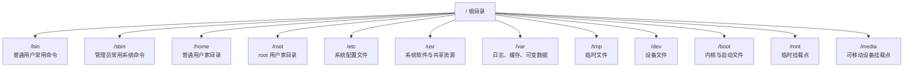
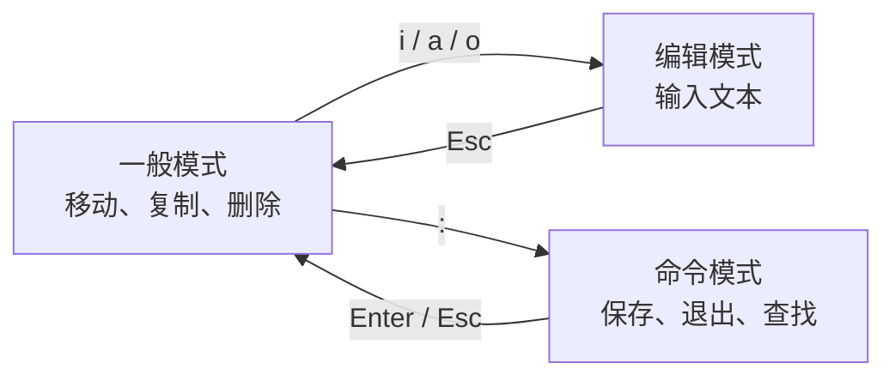
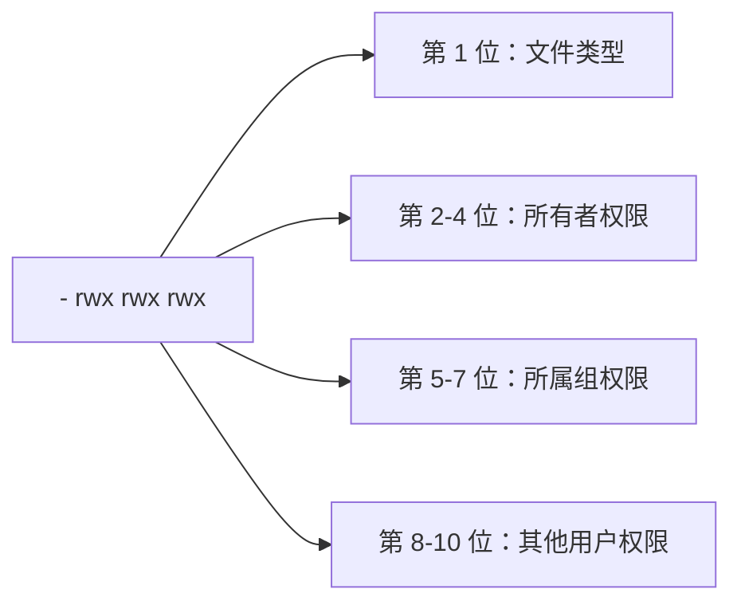
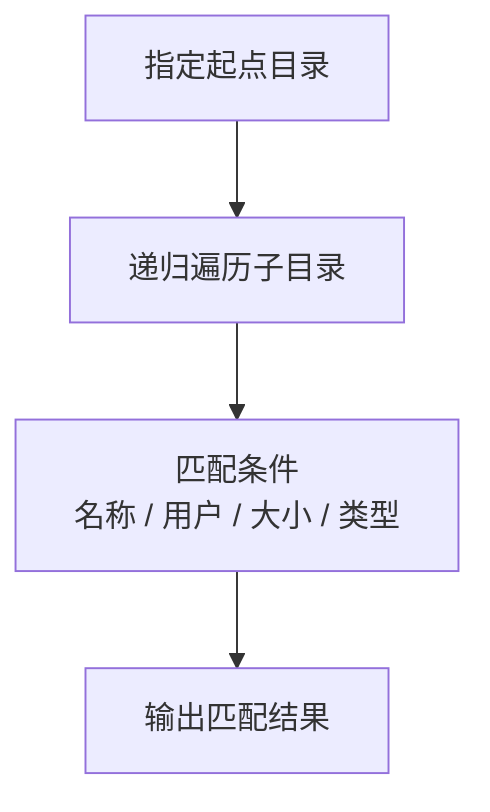

# Linux 操作基础

> 本文整理 Linux 常见目录、Vim、网络配置、文件命令、权限、搜索和压缩解压等基础知识。命令示例默认在 Bash / Shell 环境下执行。

## 目录

1. [Linux 文件系统目录](#linux-文件系统目录)
2. [vi / vim 编辑器](#vi--vim-编辑器)
3. [网络配置](#网络配置)
4. [系统配置](#系统配置)
5. [常用命令](#常用命令)
6. [用户管理命令](#用户管理命令)
7. [文件权限](#文件权限)
8. [搜索查找](#搜索查找)
9. [压缩与解压](#压缩与解压)

## Linux 文件系统目录

Linux 中有一个很重要的思想：**一切皆文件**。普通文件、目录、设备、进程信息、网络接口等，都可以用类似文件的方式进行管理。



### 常见目录说明

| 目录 | 作用 |
| --- | --- |
| `/bin` | 普通用户和系统启动时常用的基本命令，如 `ls`、`cp`、`mv`。 |
| `/sbin` | 系统管理员常用的系统管理命令，`s` 通常表示 system/superuser。 |
| `/home` | 普通用户的主目录，例如用户 `tom` 的家目录通常是 `/home/tom`。 |
| `/root` | 超级管理员 `root` 用户的家目录。 |
| `/lib`、`/lib64` | 系统和程序运行所需的共享库，类似 Windows 中的 DLL。 |
| `/etc` | 系统配置文件目录，如网络配置、服务配置、用户配置等。 |
| `/usr` | 系统软件、库文件、文档和共享资源，类似系统级应用目录。 |
| `/boot` | 启动 Linux 所需的内核、引导程序配置和镜像文件。 |
| `/srv` | service 的缩写，用于存放服务运行所需的数据。 |
| `/tmp` | 临时文件目录，通常任何用户都可以写入，系统可能定期清理。 |
| `/dev` | 设备文件目录，硬盘、终端、随机数设备等都以文件形式存在。 |
| `/media` | 自动挂载 U 盘、光盘等可移动设备的位置。 |
| `/mnt` | 临时挂载其他文件系统的位置，常用于手动挂载磁盘。 |
| `/opt` | 第三方大型软件的安装目录，例如某些数据库或商业软件。 |
| `/var` | 经常变化的数据，如日志、缓存、队列、邮件、运行状态文件。 |
| `/lost+found` | 文件系统异常恢复时存放修复出来的文件，通常为空。 |
| `/www` | 不是 Linux 标准必备目录，有些服务器会自定义用于存放网站文件。 |

## vi / vim 编辑器

`vi` 是 Unix 和类 Unix 系统中经典的文本编辑器；`vim` 是 `vi` 的增强版，支持语法高亮、更多编辑能力和插件扩展。

终端提示符常见格式：

```text
用户名@主机名 当前目录 提示符
```

示例：

```bash
root@server:~#   # root 管理员用户，# 通常表示管理员提示符
tom@server:~$    # 普通用户，$ 通常表示普通用户提示符
```

### Vim 模式转换



进入文件后默认是**一般模式**。想输入内容，按 `i`、`a` 或 `o` 进入编辑模式；想保存或退出，先按 `Esc` 回到一般模式，再输入命令。

### 一般模式常用操作

| 命令 | 作用 |
| --- | --- |
| `h` / `j` / `k` / `l` | 左 / 下 / 上 / 右移动光标。 |
| `yy` | 复制当前行。 |
| `p` | 粘贴。 |
| `dd` | 删除当前行。 |
| `ndd` | 删除从当前行开始的 `n` 行，例如 `3dd`。 |
| `u` | 撤销上一步操作。 |
| `G` | 跳到文件末尾。 |
| `gg` | 跳到文件开头。 |
| `nG` | 跳到第 `n` 行，例如 `20G`。 |

### 编辑模式常用入口

| 命令 | 作用 |
| --- | --- |
| `i` | 在光标前插入。 |
| `a` | 在光标后插入。 |
| `o` | 在当前行下一行新建一行并插入。 |
| `I` | 在当前行行首插入。 |
| `A` | 在当前行行尾插入。 |
| `O` | 在当前行上一行新建一行并插入。 |

### 命令模式常用操作

| 命令 | 作用 |
| --- | --- |
| `:w` | 保存。 |
| `:q` | 退出。 |
| `:wq` | 保存并退出。 |
| `:q!` | 不保存强制退出。 |
| `:set nu` | 显示行号。 |
| `:set nonu` | 取消显示行号。 |
| `/关键字` | 向下搜索关键字。 |
| `?关键字` | 向上搜索关键字。 |

## 网络配置

不同 Linux 发行版的网络配置方式不同。下面以常见的 CentOS/RHEL 7 系列配置文件为例。

### 修改 IP 地址

CentOS/RHEL 7 常见网卡配置文件路径：

```bash
vim /etc/sysconfig/network-scripts/ifcfg-ens33
```

常见配置项：

```ini
BOOTPROTO=static
ONBOOT=yes
IPADDR=192.168.220.151
NETMASK=255.255.255.0
GATEWAY=192.168.220.2
DNS1=8.8.8.8
```

修改后重启网络服务：

```bash
systemctl restart network
```

> 注意：较新的 CentOS Stream、RHEL、Ubuntu 等系统可能使用 `NetworkManager`、`nmcli`、`netplan` 等方式管理网络，不一定存在上面的配置文件。

### 配置主机名

查看当前主机名：

```bash
hostname
```

临时修改主机名：

```bash
hostname new-hostname
```

永久修改主机名，推荐使用：

```bash
hostnamectl set-hostname new-hostname
```

也可以编辑主机名配置文件：

```bash
vim /etc/hostname
```

### 修改 hosts 映射文件

主机名和 IP 的映射文件是 `/etc/hosts`，不是 `/etc/hostname`。

```bash
vim /etc/hosts
```

示例：

```text
192.168.220.151 service
```

保存后，可以通过主机名访问：

```bash
ping service
```

## 系统配置

本节可继续补充防火墙、服务管理、环境变量、软件源等内容。

## 常用命令

### 文件目录类

#### pwd：显示当前目录

`pwd` 用于显示当前工作目录的绝对路径。

```bash
pwd
```

#### ls：列出目录内容

语法：

```bash
ls [选项] [目录或文件]
```

常用选项：

| 选项 | 作用 |
| --- | --- |
| `-l` | 以长格式显示文件信息。 |
| `-a` | 显示所有文件，包括隐藏文件。 |
| `-h` | 与 `-l` 搭配，以更易读的单位显示大小。 |
| `-t` | 按修改时间排序，最新的在前。 |
| `-R` | 递归显示子目录内容。 |
| `-i` | 显示 inode 号码。 |

组合示例：

```bash
ls -al
ls -lh
```

`ls -l` 每行信息一般包括：文件类型与权限、硬链接数、所有者、所属组、文件大小、修改时间、文件名。

#### cd：切换目录

| 命令 | 作用 |
| --- | --- |
| `cd /` | 切换到根目录。 |
| `cd ~` | 切换到当前用户家目录。 |
| `cd ..` | 切换到上一级目录。 |
| `cd -` | 回到上一次所在目录。 |
| `cd /path/to/dir` | 切换到指定目录。 |

#### mkdir / rmdir：创建或删除空目录

创建目录：

```bash
mkdir you
mkdir -p you/dssz/meihouwang
```

`-p` 表示递归创建多级目录，如果上级目录不存在会一起创建。

删除空目录：

```bash
rmdir you/dssz/meihouwang
```

#### touch：创建空文件或更新时间

```bash
touch you/dssz/A.txt
```

如果文件不存在，`touch` 会创建空文件；如果文件已存在，会更新文件时间戳。

#### cp：复制文件或目录

复制文件：

```bash
cp you/A.txt me/
```

递归复制目录：

```bash
cp -r you/ me/
```

#### rm：删除文件或目录

```bash
rm 文件名
rm -r 目录名
rm -rf 目录名
```

常用选项：

| 选项 | 作用 |
| --- | --- |
| `-r` | 递归删除目录及目录内容。 |
| `-f` | 强制删除，不提示。 |
| `-i` | 删除前逐个确认。 |

> `rm -rf` 非常危险，尤其不要随意对 `/`、`/usr`、`/etc` 等系统目录使用。

#### mv：移动或重命名

重命名：

```bash
mv oldNameFile newNameFile
```

移动文件：

```bash
mv /tmp/movefile /targetFolder/
```

示例：

```bash
mv your/Love/UP.txt your/Love/BREAK.txt
mv your/Love.txt /bin/
```

#### cat：查看文件内容

`cat` 适合查看较小文件，内容会从第一行开始输出。

```bash
cat Love.txt
cat -n Love.txt
```

`-n` 表示显示行号。

#### more：分页查看文件

```bash
more Love.txt
```

常用按键：

| 按键 | 作用 |
| --- | --- |
| `Space` | 向下翻一页。 |
| `Enter` | 向下翻一行。 |
| `q` | 退出。 |

#### less：更强的分页查看工具

`less` 与 `more` 类似，但功能更强，适合查看大文件。它不会一次性加载整个文件。

```bash
less Love.txt
```

常用按键：

| 按键 | 作用 |
| --- | --- |
| `Space` | 向下翻一页。 |
| `b` | 向上翻一页。 |
| `/关键字` | 向下搜索。 |
| `?关键字` | 向上搜索。 |
| `n` | 跳到下一个匹配项。 |
| `q` | 退出。 |

#### echo：输出内容

```bash
echo "yy\yy"
echo -e "yyy\tyyy"
```

`-e` 表示启用反斜线转义，例如 `\t` 制表符、`\n` 换行。

#### tail：查看文件尾部

`tail` 默认显示文件最后 10 行。

```bash
tail smartd.txt
tail -n 1 smartd.txt
tail -f yyy.txt
```

`tail -f` 常用于实时追踪日志。

终端控制：

| 快捷键 | 作用 |
| --- | --- |
| `Ctrl + S` | 暂停终端输出。 |
| `Ctrl + Q` | 恢复终端输出。 |
| `Ctrl + C` | 中断当前命令。 |

#### 输出重定向：`>` 和 `>>`

```bash
ls -l > y.txt
ls -l >> y.txt
echo hello >> y.txt
```

区别：

| 符号 | 作用 |
| --- | --- |
| `>` | 覆盖写入文件。 |
| `>>` | 追加写入文件。 |

#### ln：软链接

软链接也叫符号链接，类似 Windows 快捷方式，保存的是目标文件或目录的路径。

语法：

```bash
ln -s 原文件或目录 软链接名
```

创建软链接：

```bash
ln -s /y/s.txt ./s
```

查看软链接：

```bash
ls -l s
```

软链接在 `ls -l` 中第一位通常显示为 `l`，末尾会显示指向关系，例如：

```text
s -> /y/s.txt
```

删除软链接：

```bash
rm s
```

> 删除指向目录的软链接时，不要在软链接名后面加 `/`。例如 `rm -rf s/` 可能会删除目标目录中的内容。

#### history：查看历史命令

查看已经执行过的历史命令：

```bash
history
```

清空当前用户的历史记录：

```bash
history -c
```

### 时间日期类

显示当前时间：

```bash
date
```

设置系统时间：

```bash
date -s "2025-06-12 11:33:22"
```

> 实际服务器更推荐使用 NTP 或 chrony 自动同步时间，而不是手动设置。

## 用户管理命令

本节可继续补充 `useradd`、`passwd`、`usermod`、`userdel`、`groupadd` 等命令。

## 文件权限

### 查看文件权限

常用命令：

```bash
ls -l
ls -lh
```

有些发行版会默认提供 `ll`，它通常是 `ls -l` 或 `ls -alF` 的别名；如果没有该别名，可以直接使用 `ls -l`。

### 权限结构图



示例：

```text
-rw-r--r-- 1 tom dev  120 May  8 10:00 note.txt
drwxr-xr-x 2 tom dev 4096 May  8 10:00 docs
```

字段含义：

| 字段 | 含义 |
| --- | --- |
| 文件类型与权限 | 如 `-rw-r--r--`、`drwxr-xr-x`。 |
| 链接数 | 文件表示硬链接数；目录通常表示子目录数量加 2。 |
| 所有者 | 文件或目录所属用户。 |
| 所属组 | 文件或目录所属用户组。 |
| 大小 | 文件大小，目录通常显示目录项本身大小。 |
| 时间 | 最近修改时间。 |
| 文件名 | 文件或目录名称。 |

常见文件类型：

| 标识 | 类型 |
| --- | --- |
| `-` | 普通文件。 |
| `d` | 目录。 |
| `l` | 软链接。 |
| `c` | 字符设备。 |
| `b` | 块设备。 |

### `rwx` 对文件和目录的含义

| 权限 | 作用到文件 | 作用到目录 |
| --- | --- | --- |
| `r` read | 可以读取文件内容。 | 可以列出目录内容，需要配合 `x` 才能完整访问详情。 |
| `w` write | 可以修改文件内容，但不代表可以删除文件。 | 可以在目录内创建、删除、重命名文件，需要配合 `x`。 |
| `x` execute | 可以执行文件，例如脚本或程序。 | 可以进入目录，也可以访问目录中的已知文件名。 |

### chmod：修改权限

符号方式：

```bash
chmod [{ugoa}{+-=}{rwx}] 文件或目录
```

含义：

| 符号 | 含义 |
| --- | --- |
| `u` | 所有者 user。 |
| `g` | 所属组 group。 |
| `o` | 其他用户 other。 |
| `a` | 所有人，即 `u`、`g`、`o`。 |
| `+` | 增加权限。 |
| `-` | 取消权限。 |
| `=` | 直接赋予权限。 |

示例：

```bash
chmod u+x your.txt
chmod g+x your.txt
chmod u-x,o+x you.txt
```

数字方式：

```bash
chmod [mode] 文件或目录
```

数字含义：

```text
r = 4
w = 2
x = 1
rwx = 4 + 2 + 1 = 7
rw- = 4 + 2 = 6
r-- = 4
```

示例：

```bash
chmod 755 script.sh
chmod 644 note.txt
chmod -R 755 you/
```

> `chmod 777` 表示所有人都可读、可写、可执行，权限非常大，生产环境应谨慎使用。

### chown：改变所有者

语法：

```bash
chown [选项] 用户[:用户组] 文件或目录
```

常用选项：

| 选项 | 作用 |
| --- | --- |
| `-R` / `--recursive` | 递归更改目录及其内容的所有权。 |
| `-v` / `--verbose` | 显示详细操作信息。 |
| `-h` / `--no-dereference` | 更改符号链接本身，而不是链接指向的文件。 |
| `--from=当前用户:当前组` | 只在当前所有者或组匹配时才更改。 |

修改文件所有者：

```bash
chown newuser file.txt
```

递归修改目录所有者和所属组：

```bash
chown -R newuser:newgroup yyy/
```

### chgrp：改变所属组

语法：

```bash
chgrp 用户组 文件或目录
```

示例：

```bash
chgrp root s.txt
```

## 搜索查找

### find：查找文件或目录

`find` 会从指定目录开始，递归遍历子目录，并输出满足条件的文件或目录。



按文件名查找：

```bash
find . -name "*.txt"
find yourLove/ -name "rel_i_me.txt"
```

按拥有者查找：

```bash
find /opt -user username
```

按文件大小查找：

```bash
find /LoveMe -size +200M
find /LoveMe -size -200M
find /LoveMe -size 200M
```

大小条件中，`+n` 表示大于，`-n` 表示小于，`n` 表示等于。常见单位有 `k`、`M`、`G`。

### locate：快速定位文件路径

`locate` 基于预先建立的文件名数据库查询，速度很快，但结果可能不是实时的。

安装并更新数据库后使用：

```bash
updatedb
locate filename
```

> 第一次使用前通常需要执行 `updatedb`。部分系统默认没有安装 `locate`，可能需要先安装 `mlocate` 或 `plocate`。

### grep：过滤查找与管道符

管道符 `|` 表示把前一个命令的输出，传递给后一个命令继续处理。

```bash
ls | grep -n test
```

`grep` 用于在文本中查找指定字符串或正则表达式，并输出匹配行。

常用选项：

| 选项 | 作用 |
| --- | --- |
| `-i` | 忽略大小写。 |
| `-r` | 递归搜索目录。 |
| `-v` | 反向匹配，显示不包含关键字的行。 |
| `-l` | 只输出匹配的文件名。 |
| `-n` | 显示匹配行号。 |

示例：

```bash
grep "Love" Love.txt
grep "Love" file1 file2 file3
grep -i "Love" filename
grep -r "Love" directory
grep -n "XXX" filename
grep -v "UNLOVE" filename
grep "Love" filename > oo.txt
```

## 压缩与解压

### gzip / gunzip

`gzip` 用于压缩文件，`gunzip` 用于解压 `.gz` 文件。

特点：

1. 通常只压缩文件，不直接压缩目录。
2. 默认不保留原文件。
3. 同时压缩多个文件时，会生成多个 `.gz` 文件。

压缩：

```bash
gzip Love.txt
```

解压：

```bash
gunzip inTest.txt.gz
```

### zip / unzip

`zip` 和 `unzip` 在 Windows 与 Linux 中都很常见，`zip` 默认会保留原文件。

压缩文件：

```bash
zip inTest.zip inTest.txt
```

递归压缩目录：

```bash
zip -r XXX.zip XXX/
```

解压：

```bash
unzip inTest.zip
```

指定解压目录：

```bash
unzip inTest.zip -d /MyLove
```

### tar：打包与压缩

`tar` 本身主要用于打包，把多个文件或目录合成一个归档文件；配合 `gzip`、`bzip2`、`xz` 等工具可以同时压缩。

常用选项：

| 选项 | 作用 |
| --- | --- |
| `-c` | 创建归档文件。 |
| `-x` | 解开归档文件。 |
| `-v` | 显示处理过程。 |
| `-f` | 指定归档文件名，后面必须紧跟文件名。 |
| `-z` | 使用 gzip 压缩或解压，常见后缀为 `.tar.gz`。 |
| `-C` | 指定解压目录。 |

压缩文件：

```bash
tar -zcvf filename.tar.gz filename1.txt filename2.txt
tar -zcvf Love.tar.gz dimo/
```

解压到当前目录：

```bash
tar -zxvf XXX.tar.gz
```

解压到指定目录：

```bash
tar -zxvf XXX.tar.gz -C /Love
```