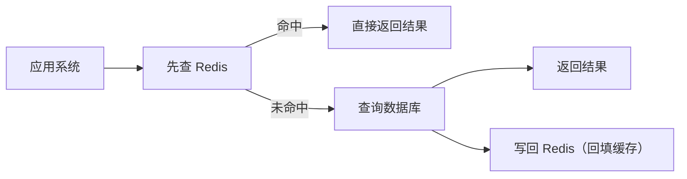
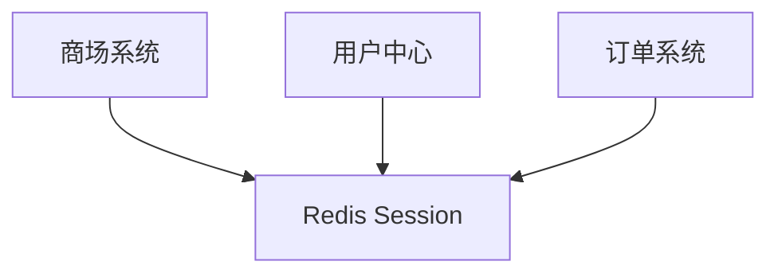
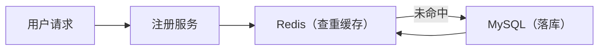

## Redis 简介  
Redis 是现在最受欢迎的  NoSQL 数据库之一，Redis是一个包含多种数据结构，支持网络，基于内存，可选持久性的键值对存储数据库。
> 广义上来说 Redis 可以称为数据库。Redis 也符合”按照数据结构来组织，存储和管理数据的仓库“  
NoSQL 是各自资料中常见的词，他是 ”Not Only SQL“ 的缩写，泛指非关系型数据库。  
我们常见的 MySQL， sqlServer 都是关系型数据库，这些数据库一般用来存储重要信息，对应普通的业务是没有问题的，但是随着互联网的高速发展，传统关系型数据库在应对超大规模，超大流量以及高并发的时候力不从心，这时候需要 类似 Redis 这类 NoSQL数据库。  

## Redis 使用场景
Redis 的核心使用场景是作为数据缓存（cache）。因为其数据读取速度快，能够显著提高系统吞吐量。  
缓存，顾名思义，就是把数据放到缓冲区里面，当查询数据的时候，首先会在 缓存里面进行查找，  


（流程说明：应用系统先查 Redis，命中则返回结果；未命中则查询数据库，并可将结果回填到 Redis）
读写缓存内容的Value，都是通过 Key来完成的。用 Key 进行查询的方式，非常简单，不像关系型数据库。可以写各种查询调节进行查询。
所以 Redis 缓存与 MySQL 等数据库并不冲突，而是有益的互补关系。  
Redis 速度快的第一原因，是数据存储在计算机内存里面，但是空间有限。  

## Redis 优点与缺点 
### 优点
数据读取速度快是其中之一。  
* 支持多种数据类型   
Redis 支持 Set，ZSet，List，Hash，String 这五种数据类型。   
> Redis 是 ANSI c 语言编写的，并不是 Java   
* 持久化存储   
把数据从内存保存到磁盘上，从而保证计算机掉电不丢失，叫做持久化。  
> 持久化是一个比较宽泛的概念，数据以任何形式  
作为一个内存数据库，最担心的是万一机器死机，数据就会消失掉。Redis 使用 RDB 和 AOF 做数据的持久化存储。主从数据同时生成 rdb 文件，并利用缓存区添加新的数据更新操作做对应同步。  
1. rdb：在指定的时间间隔内将内存中的数据集快照写入磁盘   
2. aof：以日志的形式记录服务器所处理的每一写，删操作，查询操作不会被记录，以文本的形式保存。   
* 性能好    
由于全是内存操作，所以读写性能很好，可以达到 10w/s 的频率。   
### 缺点  
* 容量问题  
由于 Redis 是内存数据库，短时间内大量增加数据，可能导致内存不够用。   
Redis 本身有数据过期策略。但是还是需要提前预估和节约内存。如果内存增长过快，需要定期删除数据。   
* 持久化存储性能损耗问题  
如果进行完整持久化，就需要生成 RDB 文件并传输保存，会占用主机的 CPU，并消耗网络带宽。  
* 重启很慢  
将数据从磁盘加载进来，时间比较久  

## Docker 启动 Redis
`sudo docker run  --name redis -p 6379:6379 -d --restart=always registry.cn-hangzhou.aliyuncs.com/xxx/redis:7.4.0 redis-server --appendonly yes --requirepass "Hello122342"`
```bash
sudo docker run 
--name redis \          # 容器名字叫 redis（唯一标识）
-p 6379:6379 \          # 端口映射：主机6379 → 容器6379
-d \                    # 后台运行容器（守护进程模式）
--restart=always \      # 开机/ Docker重启时，自动启动Redis
registry.cn-hangzhou.aliyuncs.com/xxx/redis:7.4.0 \  # 阿里云镜像地址
redis-server \          # 容器内启动Redis服务的命令
--appendonly yes \      # 开启Redis持久化（AOF，数据不丢失）
--requirepass "Hello122342"  # 设置Redis密码：Hello122342
```

## Cookie 与 Session 
Cookie 可以在浏览器中保存数据，重要的使用场景就是判断用户是否登录，以辨认用户身份。出现这种技术是因为 http 为无状态协议。
### 无状态  
无状态是指浏览器每次请求都是独立的，相互完全没有关联。   
### 实现有状态的 Web   
在实际使用场景， web 应用是需要有状态的：必须先登录才能下单购物；同一个页面，会因为登录是否有状态而不同。  
实现有状态的 Web 可以结合 Session、Cookie 等状态机制辅助。   

### Cookie 与 Session 的区别
由于 Cookie 是存在客户端的，用户都是可以看见的，而且可以任意修改，这样就很不安全，于是 Session 出现。 Session 存储在服务器端， Session 是共享的，可以让两个页面都获取到。  

### Session 需要解决的问题  
Session 放在应用服务器的内存中，带来的问题是，服务器一旦出现问题，比如重启，所有的 Session 都会丢失，所有的用户都要登录。  
另外，中大型网站往往是分布式架构，有很多服务器，Session 放在一台服务器中，那么请求分到其他服务器的时候，就读不到登录状态了。   
于是就使用到 Redis 缓存。将 Session 缓存到 Redis 里，多台服务器可以共享 Session，并且 Redis 相对稳定，不会像应用服务器一样经常重启。   

> 这种不同计算机承担不同的责任，多台计算机共同形成一个完整的系统，就叫分布式系统。   

## SpringBoot 集成 Redis
### 引入依赖：  
```xml
<dependency>
    <groupId>org.springframework.boot</groupId>
    <artifactId>spring-boot-starter-data-redis</artifactId>
</dependency>
```
### 配置
application.properties 中增加 Redis 相关配置：
```properties
# Redis 服务器地址
spring.redis.host=localhost
# Redis 服务器端口号
spring.redis.port=6379
# redis 服务器密码
spring.redis.password=xxx
```
## 注册性能优化  
在一处用户登录模块开发，项目上线后，每天晚上八点服务器就会挂掉。经过分析发现，每天晚上有人恶意攻击，频繁注册。
恶意注册时，相当于服务器在短时间内收到了大量的用户注册，导致数据库处理变慢，又会反向影响处理速度，容易宕机。
> 应用处理请求过慢，会导致请求大量积压堵塞，大量消耗内存，最后导致服务器崩溃。  
### 性能优化
Redis 作为支持高并发的缓存系统，能够有效减少对 mysql 数据库的访问。适合解决此类问题。  



### 分析
在注册的过程中，有两个操作访问了数据库:
1. 判断是否重名，需要先查询。  
2. 保存用户数据
第二个操作保存用户数据，这个很难优化，这个是必须操作。  
那么重点就是第一个操作，我们可以把用户数据缓存到 Redis 里面，每次校验先从 Redis 里面查询用户服务数据。这样就可以减少对数据库的访问。   
> 用户更新数据，redis 也要实时更新数据。   

### 步骤
1. 注入 RedisTemplate 实例
RedisTemplate 是 Spring Data Redis 提供给用户的最高级抽象客户端，用户可以直接通过 RedisTemplate 进行操作。  
```java
@Component
public class UserServiceImpl implements UserService {
     @Autowired
     private UserDAO userDAO;

     @Autowired
     private RedisTemplate redisTemplate;
}
```
> 这个有点类似 MongoDB 的所有操作都是执行 MongoTemplate 提供的方法。  
> > 客户端用的比较方便
### 用户模型实现序列化接口  
要把用户数据缓存到 Redis 里的功能，用户模型必须实现序列化接口。  
```java
import java.io.Serializable;

public class UserDO implements Serializable {}
```
用户模型实例在网络上传输，必须能够实现序列化，对象序列化必须实现 Serializable 接口。
java 提供的 Serializable 接口中没有定义任何方法，相当于一个空接口：
```java
package java.io;

/**
 * Serializability of a class is enabled by the class implementing the
 * java.io.Serializable interface.
 *
 * <p><strong>Warning: Deserialization of untrusted data is inherently dangerous
 * and should be avoided. Untrusted data should be carefully validated according to the
 * "Serialization and Deserialization" section of the
 * {@extLink secure_coding_guidelines_javase Secure Coding Guidelines for Java SE}.
 * {@extLink serialization_filter_guide Serialization Filtering} describes best
 * practices for defensive use of serial filters.
 * </strong></p>
 *
 * Classes that do not implement this
 * interface will not have any of their state serialized or
 * deserialized.  All subtypes of a serializable class are themselves
 * serializable.  The serialization interface has no methods or fields
 * and serves only to identify the semantics of being serializable. <p>
 *
 * It is possible for subtypes of non-serializable classes to be serialized
 * and deserialized. During serialization, no data will be written for the
 * fields of non-serializable superclasses. During deserialization, the fields of non-serializable
 * superclasses will be initialized using the no-arg constructor of the first (bottommost)
 * non-serializable superclass. This constructor must be accessible to the subclass that is being
 * deserialized. It is an error to declare a class Serializable if this is not
 * the case; the error will be detected at runtime. A serializable subtype may
 * assume responsibility for saving and restoring the state of a non-serializable
 * supertype's public, protected, and (if accessible) package-access fields. See
 * the <a href="{@docRoot}/../specs/serialization/input.html#the-objectinputstream-class">
 * <cite>Java Object Serialization Specification,</cite></a> section 3.1, for
 * a detailed specification of the deserialization process, including handling of
 * serializable and non-serializable classes. <p>
 *
 * When traversing a graph, an object may be encountered that does not
 * support the Serializable interface. In this case the
 * NotSerializableException will be thrown and will identify the class
 * of the non-serializable object. <p>
 *
 * Classes that require special handling during the serialization and
 * deserialization process must implement special methods with these exact
 * signatures:
 *
 * <PRE>
 * private void writeObject(java.io.ObjectOutputStream out)
 *     throws IOException;
 * private void readObject(java.io.ObjectInputStream in)
 *     throws IOException, ClassNotFoundException;
 * private void readObjectNoData()
 *     throws ObjectStreamException;
 * </PRE>
 *
 * <p>The writeObject method is responsible for writing the state of the
 * object for its particular class so that the corresponding
 * readObject method can restore it.  The default mechanism for saving
 * the Object's fields can be invoked by calling
 * out.defaultWriteObject. The method does not need to concern
 * itself with the state belonging to its superclasses or subclasses.
 * State is saved by writing the individual fields to the
 * ObjectOutputStream using the writeObject method or by using the
 * methods for primitive data types supported by DataOutput.
 *
 * <p>The readObject method is responsible for reading from the stream and
 * restoring the classes fields. It may call in.defaultReadObject to invoke
 * the default mechanism for restoring the object's non-static and
 * non-transient fields.  The defaultReadObject method uses information in
 * the stream to assign the fields of the object saved in the stream with the
 * correspondingly named fields in the current object.  This handles the case
 * when the class has evolved to add new fields. The method does not need to
 * concern itself with the state belonging to its superclasses or subclasses.
 * State is restored by reading data from the ObjectInputStream for
 * the individual fields and making assignments to the appropriate fields
 * of the object. Reading primitive data types is supported by DataInput.
 *
 * <p>The readObjectNoData method is responsible for initializing the state of
 * the object for its particular class in the event that the serialization
 * stream does not list the given class as a superclass of the object being
 * deserialized.  This may occur in cases where the receiving party uses a
 * different version of the deserialized instance's class than the sending
 * party, and the receiver's version extends classes that are not extended by
 * the sender's version.  This may also occur if the serialization stream has
 * been tampered; hence, readObjectNoData is useful for initializing
 * deserialized objects properly despite a "hostile" or incomplete source
 * stream.
 *
 * <p>Serializable classes that need to designate an alternative object to be
 * used when writing an object to the stream should implement this
 * special method with the exact signature:
 *
 * <PRE>
 * ANY-ACCESS-MODIFIER Object writeReplace() throws ObjectStreamException;
 * </PRE><p>
 *
 * This writeReplace method is invoked by serialization if the method
 * exists and it would be accessible from a method defined within the
 * class of the object being serialized. Thus, the method can have private,
 * protected and package-private access. Subclass access to this method
 * follows java accessibility rules. <p>
 *
 * Classes that need to designate a replacement when an instance of it
 * is read from the stream should implement this special method with the
 * exact signature.
 *
 * <PRE>
 * ANY-ACCESS-MODIFIER Object readResolve() throws ObjectStreamException;
 * </PRE><p>
 *
 * This readResolve method follows the same invocation rules and
 * accessibility rules as writeReplace.<p>
 *
 * Enum types are all serializable and receive treatment defined by
 * the <a href="{@docRoot}/../specs/serialization/index.html"><cite>
 * Java Object Serialization Specification</cite></a> during
 * serialization and deserialization. Any declarations of the special
 * handling methods discussed above are ignored for enum types.<p>
 *
 * Record classes can implement {@code Serializable} and receive treatment defined
 * by the <a href="{@docRoot}/../specs/serialization/serial-arch.html#serialization-of-records">
 * <cite>Java Object Serialization Specification,</cite> Section 1.13,
 * "Serialization of Records"</a>. Any declarations of the special
 * handling methods discussed above are ignored for record types.<p>
 *
 * The serialization runtime associates with each serializable class a version
 * number, called a serialVersionUID, which is used during deserialization to
 * verify that the sender and receiver of a serialized object have loaded
 * classes for that object that are compatible with respect to serialization.
 * If the receiver has loaded a class for the object that has a different
 * serialVersionUID than that of the corresponding sender's class, then
 * deserialization will result in an {@link InvalidClassException}.  A
 * serializable class can declare its own serialVersionUID explicitly by
 * declaring a field named {@code "serialVersionUID"} that must be static,
 * final, and of type {@code long}:
 *
 * <PRE>
 * ANY-ACCESS-MODIFIER static final long serialVersionUID = 42L;
 * </PRE>
 *
 * If a serializable class does not explicitly declare a serialVersionUID, then
 * the serialization runtime will calculate a default serialVersionUID value
 * for that class based on various aspects of the class, as described in the
 * <a href="{@docRoot}/../specs/serialization/index.html"><cite>Java Object Serialization
 * Specification.</cite></a> This specification defines the
 * serialVersionUID of an enum type to be 0L. However, it is <em>strongly
 * recommended</em> that all serializable classes other than enum types explicitly declare
 * serialVersionUID values, since the default serialVersionUID computation is
 * highly sensitive to class details that may vary depending on compiler
 * implementations, and can thus result in unexpected
 * {@code InvalidClassException}s during deserialization.  Therefore, to
 * guarantee a consistent serialVersionUID value across different java compiler
 * implementations, a serializable class must declare an explicit
 * serialVersionUID value.  It is also strongly advised that explicit
 * serialVersionUID declarations use the {@code private} modifier where
 * possible, since such declarations apply only to the immediately declaring
 * class--serialVersionUID fields are not useful as inherited members. Array
 * classes cannot declare an explicit serialVersionUID, so they always have
 * the default computed value, but the requirement for matching
 * serialVersionUID values is waived for array classes.
 *
 * @spec serialization/index.html Java Object Serialization Specification
 * @see java.io.ObjectOutputStream
 * @see java.io.ObjectInputStream
 * @see java.io.ObjectOutput
 * @see java.io.ObjectInput
 * @see java.io.Externalizable
 * @since   1.1
 */
public interface Serializable {
}
```
那么实现了 Serializable 接口，不必再多写方法实现代码，意义主要是**标识**此对象能够被序列化。   

### 优化重名判断逻辑  

修改 UserServiceImpl.register() 代码，有先从 Redis 查询此用户名有没有对应的用户对象，如果没有，再从数据库查询一遍。  
```java
UserDO userDO = (UserDO)redisTemplate.opsForValue().get(userName);

i(userOD == null){
     userDO = userDAO.findByUserName(userName);
}
if(user != null){
     result.setCode("602");
     result.setMessage("用户存在");
     return result;
}
```
要读写缓存Value，就要调用 redisTemplate.opsForValue()，然后再调用 get() 方法，根据 key 取得缓存值。这里以用户名作为缓存 key   
redisTemplate.opsForValue() 相当于固定用法。


### 用户实例放入缓存  
UserServiceImpl.register() 方法结尾，调用 DAO 方法祥数据库增加一条数据后，把新用户实例存入 Redis： 
```java
userDAO.add(userDO1);

result.setSuccess(true);
User user = userDO1.toModel();
result.setData(user);

// 新用户注册成功，存放入缓存 
redisTemplate.opsForValue().set(userName, userDO1);
```
向 Redis 存数据，同样需要调用 redisTemplate.opsForValue(), 再调用 set() 方法：
> 存数据的 Key 要和读数据的 Key 和 Value 对应起来
由于新用户注册成功后，对象存入缓存，那么重新注册的时候，就不会读取数据库了，只会从缓存查询一次数据。

## 用户 Session  
我们现在来引入 Redis， 作为 Session 数据的缓存，以解决分布式系统的共享 Session 问题。  
### 依赖引入  
修改 pom 文件，先删除旧的依赖项：   
```xml
<dependency>
  <groupId>org.springframework.session</groupId>
  <artifactId>spring-session-core</artifactId>
</dependency>
``` 
然后添加相关的依赖：

```xml
<!-- spring session 支持 -->
<dependency>
  <groupId>org.springframework.session</groupId>
  <artifactId>spring-session-data-redis</artifactId>
</dependency>
<dependency>
  <groupId>org.redisson</groupId>
  <artifactId>redisson-spring-boot-starter</artifactId>
  <version>3.13.0</version>
</dependency>
```  
* `spring-session-data-redis` 是核心依赖库，会自动完成 Session 同步到 Redis 等操作  
* `redisson-spring-boot-starter` 是需要用到的 Redis 客户端，提供很多分布式相关操作服务，操作 Session 数据的过程中，与核心依赖库搭配使用。   

### 修改 Session 配置类  
之前我们使用 spring 封装实现的 Session：
```java
@Configuration
@EnableSpringHttpSession
public class SpringHttpSessionConfig {
    @Bean
    public CookieSerializer cookieSerializer() {
        ...
    }

    @Bean
    public MapSessionRepository sessionRepository() {
        return new MapSessionRepository(new ConcurrentHashMap<>());
    }
} 
```
核心是使用 @EnableSpringHttpSession 注解。 


#### 数据仓库   
Session 数据存储在服务器，是具体在哪?   
系统未提供默认的存储 Session 数据的仓库，所以需要在 sessionRepository() 方法中 new 一个仓库对象。     
> Session 存储于服务器的内存在学习阶段是没有问题，但是在分布式系统中就不合适了。   
实际上每个用户的 Session 数据存储于线程安全的，支持高效并发的 ConcurrentHashMap。   
> ConcurrentHashMap 是 java.util.concurrent 包的重要成员
#### 定制 Session Cookie   
`cookieSerializer()`  的作用是定制 Cookie 中的 Session 信息内容如何写   
#### 两个修改步骤   
引入 Redis 解决分布式系统的共享 Session 问题，就需要对代码做一些修改   
我们要使用 Redis 存储的 Session 的方案，核心就是删除 @EnableSpringHttpSession 注解，改为 @EnableRedisHttpSession 注解    
然后删除 `sessionRepository()` 方法，不再创建仓库，Redis就是 仓库，系统已经封装好了。   
```java
import org.springframework.context.annotation.Bean;
import org.springframework.context.annotation.Configuration;
import org.springframework.session.data.redis.config.annotation.web.http.EnableRedisHttpSession;
import org.springframework.session.web.http.CookieSerializer;
import org.springframework.session.web.http.DefaultCookieSerializer;

@Configuration
@EnableRedisHttpSession(maxInactiveIntervalInSeconds = 300)
public class SpringHttpSessionConfig {
    @Bean 
    public CookieSerializer cookieSerializer() {
        ...
    }
}
```
> `cookieSerializer()` 保持不变，仍然可以制定 Cookie 中的 Session 信息内容如何写。   
使用注解的优点就有了，只需要一个注解，系统自动完成 Session 数据 同步存储到 Redis。   
#### 过期时间   
在使用 @EnableRedisHttpSession 时，可以通过 `maxInactivalInSeconds` 注解参数设置 Session 数据的过期时间，单位是秒，如果不设置，默认为 30 分钟
> 由于 Redis 空间有限，所以必须根据实际情况设置一个相对合理的过期时间，既提升 Redis 利用率，又要防止空间撑满。    
