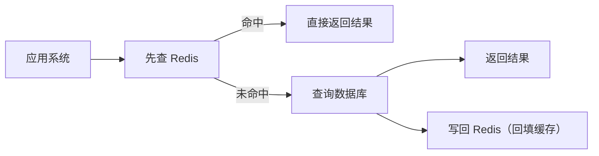
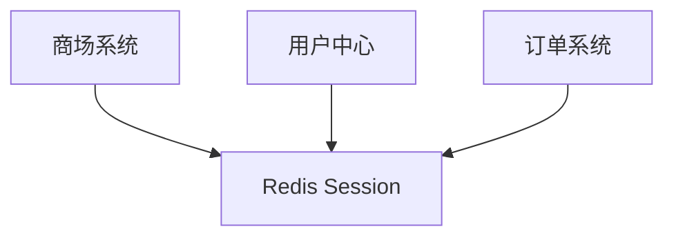
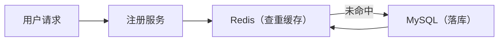

## Redis 简介  
Redis 是现在最受欢迎的  NoSQL 数据库之一，Redis是一个包含多种数据结构，支持网络，基于内存，可选持久性的键值对存储数据库。
> 广义上来说 Redis 可以称为数据库。Redis 也符合”按照数据结构来组织，存储和管理数据的仓库“  
NoSQL 是各自资料中常见的词，他是 ”Not Only SQL“ 的缩写，泛指非关系型数据库。  
我们常见的 MySQL， sqlServer 都是关系型数据库，这些数据库一般用来存储重要信息，对应普通的业务是没有问题的，但是随着互联网的高速发展，传统关系型数据库在应对超大规模，超大流量以及高并发的时候力不从心，这时候需要 类似 Redis 这类 NoSQL数据库。  

## Redis 使用场景
Redis 的核心使用场景是作为数据缓存（cache）。因为其数据读取速度快，能够显著提高系统吞吐量。  
缓存，顾名思义，就是把数据放到缓冲区里面，当查询数据的时候，首先会在 缓存里面进行查找，  


（流程说明：应用系统先查 Redis，命中则返回结果；未命中则查询数据库，并可将结果回填到 Redis）
读写缓存内容的Value，都是通过 Key来完成的。用 Key 进行查询的方式，非常简单，不像关系型数据库。可以写各种查询调节进行查询。
所以 Redis 缓存与 MySQL 等数据库并不冲突，而是有益的互补关系。  
Redis 速度快的第一原因，是数据存储在计算机内存里面，但是空间有限。  

## Redis 优点与缺点 
### 优点
数据读取速度快是其中之一。  
* 支持多种数据类型   
Redis 支持 Set，ZSet，List，Hash，String 这五种数据类型。   
> Redis 是 ANSI c 语言编写的，并不是 Java   
* 持久化存储   
把数据从内存保存到磁盘上，从而保证计算机掉电不丢失，叫做持久化。  
> 持久化是一个比较宽泛的概念，数据以任何形式  
作为一个内存数据库，最担心的是万一机器死机，数据就会消失掉。Redis 使用 RDB 和 AOF 做数据的持久化存储。主从数据同时生成 rdb 文件，并利用缓存区添加新的数据更新操作做对应同步。  
1. rdb：在指定的时间间隔内将内存中的数据集快照写入磁盘   
2. aof：以日志的形式记录服务器所处理的每一写，删操作，查询操作不会被记录，以文本的形式保存。   
* 性能好    
由于全是内存操作，所以读写性能很好，可以达到 10w/s 的频率。   
### 缺点  
* 容量问题  
由于 Redis 是内存数据库，短时间内大量增加数据，可能导致内存不够用。   
Redis 本身有数据过期策略。但是还是需要提前预估和节约内存。如果内存增长过快，需要定期删除数据。   
* 持久化存储性能损耗问题  
如果进行完整持久化，就需要生成 RDB 文件并传输保存，会占用主机的 CPU，并消耗网络带宽。  
* 重启很慢  
将数据从磁盘加载进来，时间比较久  

## Docker 启动 Redis
`sudo docker run  --name redis -p 6379:6379 -d --restart=always registry.cn-hangzhou.aliyuncs.com/xxx/redis:7.4.0 redis-server --appendonly yes --requirepass "Hello122342"`
```bash
sudo docker run 
--name redis \          # 容器名字叫 redis（唯一标识）
-p 6379:6379 \          # 端口映射：主机6379 → 容器6379
-d \                    # 后台运行容器（守护进程模式）
--restart=always \      # 开机/ Docker重启时，自动启动Redis
registry.cn-hangzhou.aliyuncs.com/xxx/redis:7.4.0 \  # 阿里云镜像地址
redis-server \          # 容器内启动Redis服务的命令
--appendonly yes \      # 开启Redis持久化（AOF，数据不丢失）
--requirepass "Hello122342"  # 设置Redis密码：Hello122342
```

## Cookie 与 Session 
Cookie 可以在浏览器中保存数据，重要的使用场景就是判断用户是否登录，以辨认用户身份。出现这种技术是因为 http 为无状态协议。
### 无状态  
无状态是指浏览器每次请求都是独立的，相互完全没有关联。   
### 实现有状态的 Web   
在实际使用场景， web 应用是需要有状态的：必须先登录才能下单购物；同一个页面，会因为登录是否有状态而不同。  
实现有状态的 Web 可以结合 Session、Cookie 等状态机制辅助。   

### Cookie 与 Session 的区别
由于 Cookie 是存在客户端的，用户都是可以看见的，而且可以任意修改，这样就很不安全，于是 Session 出现。 Session 存储在服务器端， Session 是共享的，可以让两个页面都获取到。  

### Session 需要解决的问题  
Session 放在应用服务器的内存中，带来的问题是，服务器一旦出现问题，比如重启，所有的 Session 都会丢失，所有的用户都要登录。  
另外，中大型网站往往是分布式架构，有很多服务器，Session 放在一台服务器中，那么请求分到其他服务器的时候，就读不到登录状态了。   
于是就使用到 Redis 缓存。将 Session 缓存到 Redis 里，多台服务器可以共享 Session，并且 Redis 相对稳定，不会像应用服务器一样经常重启。   

> 这种不同计算机承担不同的责任，多台计算机共同形成一个完整的系统，就叫分布式系统。   

## SpringBoot 集成 Redis
### 引入依赖：  
```xml
<dependency>
    <groupId>org.springframework.boot</groupId>
    <artifactId>spring-boot-starter-data-redis</artifactId>
</dependency>
```
### 配置
application.properties 中增加 Redis 相关配置：
```properties
# Redis 服务器地址
spring.redis.host=localhost
# Redis 服务器端口号
spring.redis.port=6379
# redis 服务器密码
spring.redis.password=xxx
```
## 注册性能优化  
在一处用户登录模块开发，项目上线后，每天晚上八点服务器就会挂掉。经过分析发现，每天晚上有人恶意攻击，频繁注册。
恶意注册时，相当于服务器在短时间内收到了大量的用户注册，导致数据库处理变慢，又会反向影响处理速度，容易宕机。
> 应用处理请求过慢，会导致请求大量积压堵塞，大量消耗内存，最后导致服务器崩溃。  
### 性能优化
Redis 作为支持高并发的缓存系统，能够有效减少对 mysql 数据库的访问。适合解决此类问题。  



### 分析
在注册的过程中，有两个操作访问了数据库:
1. 判断是否重名，需要先查询。  
2. 保存用户数据
第二个操作保存用户数据，这个很难优化，这个是必须操作。  
那么重点就是第一个操作，我们可以把用户数据缓存到 Redis 里面，每次校验先从 Redis 里面查询用户服务数据。这样就可以减少对数据库的访问。   
> 用户更新数据，redis 也要实时更新数据。   
